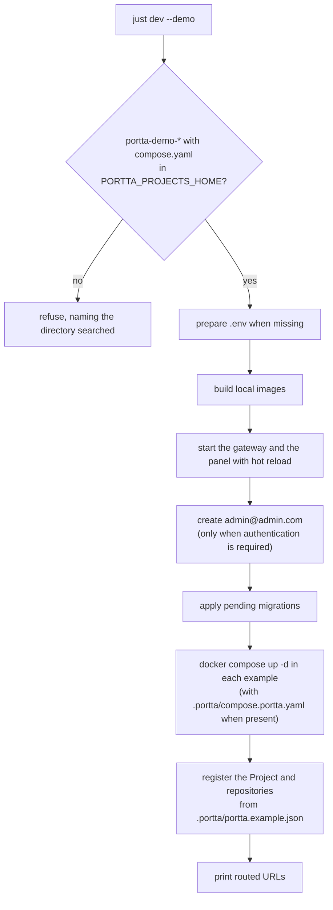

# Develop Portta

Run Portta from a clone of this repository, with the panel reloading as you edit
it. Work in an isolated checkout and namespace, and follow the
[shared-host rules](../agent-guidelines.md) before starting or removing
infrastructure.

## Requirements

| Tool | Version | Why |
| --- | --- | --- |
| Node.js and npm | Node 24 or later (`.nvmrc` names it, so `nvm use` picks it) | the CLI, the build and the tests |
| Docker Engine | 24 or later, with the Compose v2 plugin | the gateway, the panel and the demo projects |
| [just](https://github.com/casey/just) | optional | short aliases; every recipe is one call to `./bin/portta` |
| `gh`, `sqlite3` | optional | issues from GitHub through the host daemon; `portta db shell` and `portta db dump` |

## Get the checkout

```bash
git clone git@github.com:codions-labs/portta.git
cd portta
npm ci
```

`npm ci` installs every workspace from one lockfile. `bin/portta` needs it: it
builds the CLI from `packages/cli`, `packages/core`, `packages/contracts` and
`packages/host` whenever those sources are newer than the bundle, and then runs
that bundle.

## Start Portta

```bash
just dev               # or: ./bin/portta dev
```

`just dev` prints the steps it is about to run, then:

1. Links this checkout's CLI as `portta` in `~/.local/bin` (the `just` recipe
   only; see [The `portta` command](#the-portta-command)).
2. Prepares the checkout when `.env` is missing: checks Docker and Compose v2,
   creates `.env` from `.env.example`, and creates the `state/` directories.
3. Writes the checkout's panel settings into `.env` (`PORTTA_WEB=true`,
   `PORTTA_WEB_DEV=true`) so the panel runs from local images with hot reload.
4. Builds the local images from this repository's Dockerfiles, never the
   published ones, and starts the gateway and the panel.
5. Waits for the panel, creates the development owner when authentication is
   required, and applies pending database migrations.
6. Prints the panel address and the routed hostnames.

The panel answers on <http://127.0.0.1:8081>. Authentication is disabled by
default (`PORTTA_AUTH_MODE=disabled`), so there is no sign-in: every request is
the local operator. To work on accounts and roles, see
[Run with authentication enabled](#run-with-authentication-enabled).

Other useful commands:

```bash
./bin/portta web dev   # recreate only the panel, on a gateway already running
./bin/portta web up    # go back to the built panel image
just down              # stop the gateway; consumer projects keep running
```

Every `just` recipe is one call to `./bin/portta`, and flags pass through
(`just dev --demo`, `just reset --yes --demo`):

| Recipe | Runs |
|---|---|
| `just build` | `portta build` |
| `just up` | `portta up --local-release` |
| `just dev` | links this checkout's CLI into `~/.local/bin`, then `portta dev` |
| `just down`, `reset`, `bootstrap`, `restart`, `status`, `doctor`, `urls`, `logs`, `inspect`, `update` | the command of the same name (`bootstrap` adds `--skip-pull`) |
| `just web` | `portta web --local-release` |
| `just db-migrate` | `portta db migrate` |
| `just link`, `just unlink` | checkout tooling that adds or removes the `portta` link; not CLI commands |
| `just test` | `node tests/run.mjs`, the integration validation; not a CLI command |

## Run the demo

The demonstration projects are separate Git repositories named `portta-demo-*`.
Clone them side by side into one directory, and point `PORTTA_PROJECTS_HOME` in
`.env` at that directory (the default is `~/projects`):

```bash
PORTTA_PROJECTS_HOME=/path/to/portta-examples
```

Then start everything:

```bash
just dev --demo        # or: ./bin/portta dev --demo
```

`--demo` is checked before anything starts. When no `portta-demo-*` directory
with a `compose.yaml` exists at the first level of `PORTTA_PROJECTS_HOME`, the
command refuses and names the directory it searched.



Registering is idempotent: a Project or repository the panel already has is
left as it is, so running the command again is safe. The demo registers the
Projects Demo Shop (`demo-shop`), Demo Site (`demo-site`) and the Docker Compose
fixture (`portta-demo-compose`). `portta-demo-external` runs but is not adopted
by a Project. The routed URLs include:

```text
http://demo-shop-web.localhost
http://demo-shop-api.localhost
http://demo-shop-mailpit.localhost
http://demo-shop-rustfs.localhost
http://demo-site-web.localhost
http://portta-demo-compose-web.localhost
http://portta-demo-compose-api.localhost
```

No issues are seeded. Issues live in GitHub or Linear; see
[Issues in development](#issues-in-development).

```bash
just down --demo          # stop the gateway and the demo stacks, dropping their volumes
just reset --yes --demo   # wipe and start again with the demo; see Reset a checkout
```

## Issues in development

The panel never calls GitHub or Linear itself. It asks the host daemon, which
runs on your machine where `gh` is signed in, or where `LINEAR_API_KEY` is set.
The panel is always wired to the daemon, so starting it is enough:

```bash
./bin/portta host serve --detach
```

The daemon listens on `127.0.0.1:5111` and logs to `state/host/daemon.log`.
Without it, issue views say the provider could not be reached. On Linux the
panel container cannot reach a daemon on loopback; see
[Run the host daemon](../product/guides/host-daemon.md) and
[Host daemon and module proxy](host-daemon.md).

## Run with authentication enabled

```bash
./bin/portta config set panel.auth required
just dev
```

With authentication required, `just dev` creates the development owner the
first time, while the panel still has none:

| Email | Password |
| --- | --- |
| `admin@admin.com` | `secret` |

Sign in at <http://127.0.0.1:8081> with those credentials. The setting is
written to `.env` and stays until you change it back:

```bash
./bin/portta config set panel.auth disabled
just dev
```

> [!WARNING]
> `admin@admin.com` / `secret` exists only for checkout development. Never use
> it on a panel that anyone else can reach.

## Hot reload

The panel is one Node process on one port: pages, API, event stream,
WebSockets, documentation and Next's HMR all answer on
<http://127.0.0.1:8081>. There is no second server to start.

`docker/compose/features/web-dev.yaml` bind-mounts the source into the panel
container, so the image's `node_modules` stay in place:

- `apps/web/{app,components,lib,modules,messages,server,public}`
- `packages/{core,contracts,auth,db,server}/src`
- `packages/db/drizzle`, so a newly generated migration is visible to
  `just db-migrate` without a rebuild
- `docs/`, `README.md` and `CHANGELOG.md`, read-only

An edit to a page or a component reloads in the browser; an edit to
`apps/web/server/main.ts` or to what it imports restarts the process. The ForwardAuth service
(`docker/compose/features/auth-dev.yaml`) mounts `apps/auth/src` and
`apps/auth/ui` the same way and rebuilds its login page when the UI changes.

A change to `apps/web/next.config.ts`, a dependency, the lockfile or a
Dockerfile is not picked up by a mount. Run `just dev` again to rebuild the
image.

The host daemon runs on the host, not in a container. After changing
`packages/host`, start the daemon again; `bin/portta` rebuilds the CLI bundle
that contains it.

## The `portta` command

`just dev` links this checkout's CLI as `portta` in `~/.local/bin` (set
`PORTTA_LINK_DIR` to choose another directory on `PATH`), so `portta …` works
from any directory. `just link` (or `npm run cli:link`) does the same on its own
and verifies it: the `portta` your shell resolves must be this link. A different
`portta` earlier on `PATH`, such as a globally installed `@codions/portta`, is
reported by path; `just dev` only warns about it. `just unlink` (or
`npm run cli:unlink`) removes the link, and an existing `portta` that is not
this checkout's link is never replaced.

This is deliberately not `npm link`. The link points at `bin/portta`, which
rebuilds the CLI when its sources change, always targets this checkout, and
survives switching Node versions with nvm.

## The panel's database

The panel stores its data in one SQLite file, `state/panel/portta.db` in the
checkout, opened in process by the panel. There is no database container,
password or volume. If the panel cannot open the file or apply its migrations,
it exits with the reason.

```bash
just db-migrate                              # apply pending migrations to the running panel
./bin/portta db status                       # the file, and its size
./bin/portta db shell                        # sqlite3 on the file (needs sqlite3)
```

Working on the schema:

```bash
# after editing packages/db/src/schema/*.ts
npm run db:generate --workspace=portta-db   # write the migration
npm run db:check --workspace=portta-db      # prove the schema and the SQL agree
just db-migrate                              # apply it to the running panel
```

Tests do not need a running panel: they open an in-memory SQLite and apply the
same migrations (`createTestDb()` from `portta-db/testing`). See
[Develop the database schema](database-development.md) and
[Testing](testing.md).

## Reset a checkout

> [!CAUTION]
> Reset stops every Portta-managed stack on this host, drops their volumes and
> deletes the panel database. That includes development projects routed through
> this gateway. Unrelated Compose projects are left alone. Verify ownership and
> back up any state you need first (`./bin/portta db dump`).

```bash
just reset                # asks for confirmation on a TTY
just reset --yes          # same, non-interactive
just reset --yes --demo   # then start again with the demo
just dev --reset --demo   # the same sequence
```

`just reset` is `./bin/portta reset`, which is `portta dev --reset`: it wipes,
then runs `dev` again.

**Removed.** Portta-managed containers and their named volumes, development
projects on the shared Portta network, the `portta-demo-*` stacks and their
volumes, managed helpers such as the applier and the runner, the panel
database (`state/panel/portta.db` with its `-wal` and `-shm` files), and the
contents of the regenerable snapshots in `state/git`, `state/metrics` and
`state/environment`.

**Kept.** `.env`, `state/auth/`, ACME and Tailscale material, shared networks,
images, and Compose projects that are not on this gateway's network and do not
carry Portta labels.

**What takes the time.** The first `just dev` or `just reset` in a checkout,
and any run after a dependency, lockfile or Dockerfile change, builds the
development images. Source-only changes do not. Build progress is streamed, and
a step that goes quiet reports how long it has been running. `just dev --verbose`
shows every child process; `./bin/portta --quiet reset` shows none of it. A
`Ctrl-C` during a build is safe: BuildKit keeps its cache.

## Formatting and static checks

[Biome](https://biomejs.dev/) is the repository formatter, JavaScript/TypeScript
linter, and import organizer. Install the
[Biome editor extension](https://biomejs.dev/guides/editors/first-party-extensions/)
and, if you prefer, enable format-on-save.

```bash
npm run check   # formatting, lint rules and import order over the whole repository; the CI gate
npm run fix     # write the safe fixes for all three
npm run format  # write formatting only
npm run lint    # lint rules only
```

`npm run check` is the non-writing CI gate. It covers the whole repository
rather than a diff, because the repository is small enough to check in under a
second and a diff-based gate depends on a base branch the runner may not have.
Biome covers JavaScript, TypeScript, JSON, CSS and the inline scripts of HTML;
it leaves generated artifacts alone (`package-lock.json`, the committed OpenAPI
documents, the generated documentation paths, the Drizzle snapshots) and the
workflow DSL scripts under `packages/host/workflows`, which are not modules.
A rule the code deliberately does not follow is switched off in `biome.json`:

- `style/noNonNullAssertion`: `!` states an invariant the types cannot, and the
  project uses it on purpose.
- `suspicious/noTemplateCurlyInString`: tests write Compose files whose `${VAR}`
  is for Compose, not for JavaScript.
- `suspicious/noExplicitAny`, in tests only: test doubles reach into private
  fields.
- `suspicious/noArrayIndexKey`: log lines, key caps and skeleton rows have no
  identity but their position.
- `a11y/noNoninteractiveTabindex`: a `tabIndex` on the element a tooltip
  describes is what lets the keyboard open it, and a tab panel is focusable by
  the ARIA pattern.
- `a11y/useSemanticElements`: `role="group"` and `role="region"` stay on plain
  elements, because `fieldset` and `section` bring styling and semantics the
  panel does not want.
- `complexity/noImportantStyles`: the only `!important` is the reduced-motion
  override, which must win.

A single deliberate exception carries a `biome-ignore` comment with its reason
on the line before the diagnostic.

Type checking, ShellCheck, documentation validation, Compose checks,
OpenAPI and schema checks, and tests are separate commands; see
[Testing](testing.md).

```bash
npm run openapi --workspace=portta-contracts    # refresh packages/contracts/openapi.json
npm run docs:check                              # validate the documentation
```

`npm run build --workspace=portta-web` is `next build` followed by an esbuild
bundle of `server/main.ts` into `dist/server.mjs`. It needs the workspace
packages built first (`core → contracts → db → server`): under
`NODE_ENV=production` the `development` export condition does not apply, so
each resolves to its `dist/`. The image builds them in that order.

## Regenerating the screenshots

The images in `docs/images/` are captured from the real panel running the demo,
not from fixtures. Every frame is 1440×900 in English, and each file is named
after the authentication mode it shows (`auth-disabled-*.png`,
`auth-enabled-*.png`). The script is `apps/web/e2e/screenshots.mjs`; it targets
<http://127.0.0.1:8081>, or `PORTTA_PANEL_URL` when set, and refuses a panel in
the wrong mode.

Start the host daemon with a `gh` configuration nobody is signed in to, so the
images never show the operator's own GitHub issues:

```bash
GH_CONFIG_DIR="$(mktemp -d)" ./bin/portta host serve --detach
```

**Authentication disabled:**

```bash
just dev --demo
npm run screenshots --workspace=portta-web -- auth-disabled
```

**Authentication enabled.** The setup page is captured while the panel has no
owner yet, and the account pages after `just dev --demo` creates it:

```bash
./bin/portta config set panel.auth required
./bin/portta web dev                                         # the panel now asks for an owner
npm run screenshots --workspace=portta-web -- auth-enabled   # captures /setup
just dev --demo                                              # creates admin@admin.com
npm run screenshots --workspace=portta-web -- auth-enabled   # sign-in and account pages
```

Set `panel.auth` back to `disabled` and run `just dev` afterwards if you
normally work without sign-in. Change what is captured, and in which order, in
`e2e/screenshots.mjs`.
