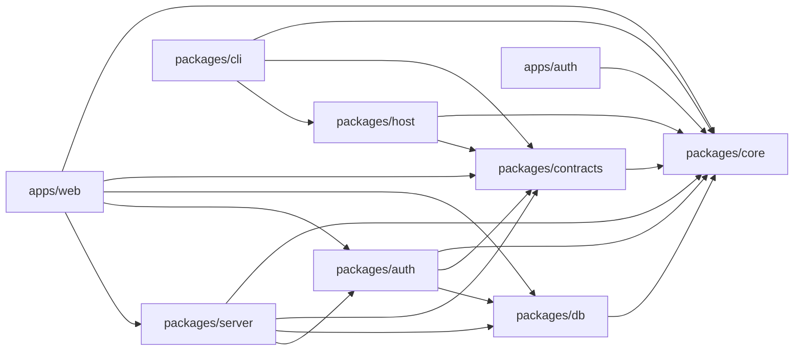

# Monorepo layout

Where new code goes, and how a command is added. The decisions behind this
page are [ADR 0014](adr/0014-monorepo-and-the-typescript-cli.md) and
[ADR 0015](adr/0015-node-is-required-on-the-host.md).

The panel lives at `apps/web`, and it composes rather than implements: the
services and the HTTP API are `packages/server`, the shapes they answer with
are `packages/contracts`, and the derivations the host and the CLI share are
`packages/core`. The TypeScript CLI lives in `packages/cli` and is configured
for publication as `@codions/portta`. `npm ci` at the repository root installs
every workspace from one lockfile.

One thing about that lockfile is worth knowing before it costs an afternoon.
Native bindings are optional dependencies chosen by platform, and npm records
`cpu` and `os` for them but not always `libc` — so inside the Alpine image it
can pick the glibc build of a package where the musl one was needed, and the
image build fails on a missing `.node` a long way from anything you changed.
Where the choice matters and can be avoided, it is: the login page's CSS is
minified by esbuild rather than by lightningcss for exactly this reason.

## Map

```text
portta/
├── apps/web/                the panel: Next.js pages and the process that serves them
│   ├── app/                 routes; (panel)/ carries the shell, docs/ the documentation
│   ├── components/          ui/ primitives, shell/, entities/, issues/, projects/, settings/
│   ├── lib/                 api client, queries, live, i18n, docs collector
│   ├── messages/            en/*.json, pt-BR/*.json
│   ├── modules/             the web registry and one directory per module (taskflow/)
│   └── server/              main.ts (the process), compose.ts (the dispatcher)
├── apps/auth/               the ForwardAuth service for project hostnames and shares
├── packages/core/           portta-core — shared derivations (private)
├── packages/contracts/      portta-contracts — API schemas, types, openapi.json
├── packages/mcp/            portta-mcp — the MCP tools, served over stdio by the CLI and over HTTP by the panel
├── packages/db/             portta-db — Drizzle schema, migrations, client
├── packages/auth/           portta-auth-core — who is asking, and what they may do
├── packages/server/         portta-server — services, Hono API, background work
├── packages/cli/            @codions/portta — TypeScript CLI, including `portta flow`
├── packages/host/           portta-host — the host daemon and its modules, bundled into the CLI
├── bin/portta                Node checkout launcher for the same CLI
├── scripts/                 fixed runner-image entrypoint only
├── docker/
│   ├── compose/              gateway Compose base and overlays
│   └── images/               operational image contexts (apply, sandbox, toolbox)
├── config/, docs/, tests/, templates/
└── package.json             workspaces: ["apps/*", "packages/*"]
```

| Workspace | Name | Published | Holds |
|---|---|---|---|
| `apps/web` | `portta-web` | no | The pages, the process that serves them, the Dockerfile, and the panel's own tests. No business rule |
| `apps/auth` | `portta-auth` | no | ForwardAuth for project hostnames and shares |
| `packages/core` | `portta-core` | no | Pure derivations: `env`, `config`, `discovery`, `capabilities`, `endpoints`, `inventory`, `apply`, `tunnel`, `password`, `metrics`. No process execution, ever |
| `packages/contracts` | `portta-contracts` | no | The API's Zod schemas and types, and the generated `openapi.json` |
| `packages/mcp` | `portta-mcp` | no (bundled into the CLI, imported by the server) | The MCP tool registrations, one call to the panel API each, and the tool lists both transports assert against. Nothing that knows a process: the CLI hands it a client and the host's resolver, the panel hands it its own API ([ADR 0054](adr/0054-mcp-tools-are-shared-and-served-over-http.md)) |
| `packages/db` | `portta-db` | no | The schema, the generated migrations and the client. No business rule |
| `packages/auth` | `portta-auth-core` | no | Better Auth, the security mode, the `Principal`, and the one `authorize` |
| `packages/server` | `portta-server` | no | Every business rule: services, the Hono API, Docker, Traefik, Git, persistence, background work, and the client that asks the host daemon for issues |
| `packages/cli` | `@codions/portta` | yes, by `publish.yaml`; see [Publish the Portta CLI](publish-cli.md) | Commands, formatting, provisioning, and every effect: `process`, `docker`, `host`, `metrics`. Its build bundles `dist/cli.js`, the daemon and its assets |
| `packages/host` | `portta-host` | no (bundled into the CLI as `dist/host.js` and `dist/supervisor.js`) | The long-running process on the host: a token-protected Hono server that answers issue requests through `gh` and Linear (`/api/forge`) and serves the modules needing git, tmux or the host's shell, starting with Taskflow. `portta host serve` starts it; `portta host service` installs it as the `portta-host` user service |

`bin/` and `scripts/` stay at the root. They are narrow runtime boundaries, not
alternative command implementations, and are not a workspace.

Runnable example projects are independent repositories under
`PORTTA_PROJECTS_HOME`, conventionally named `portta-demo-*`. The reduced
Compose and manifest inputs under `tests/fixtures/` exist only to keep Portta's
tests self-contained.

## The one rule

> **Local facts come from Core, executed locally. Persistent decisions come
> from the API. Nothing is implemented twice.**

The CLI never writes durable decisions: it asks the API. The panel is the only
writer of the SQLite database at `state/panel/portta.db`
([ADR 0013](adr/0013-what-the-panel-persists.md),
[ADR 0037](adr/0037-sqlite-is-the-panel-database.md)). The operator commands
`portta db status|shell|dump|restore` work on that file from the host
(`shell` and `dump` through `sqlite3`, `restore` only while the panel is
stopped); `portta db migrate` asks the running panel. Docker inventory,
URLs, `.env`, `doctor`, Git collection, host metrics, `bootstrap` / `up` /
`down` run locally through core.

## Who may import whom

An arrow means "may import". Anything else is a defect, and
`tests/unit/boundaries.test.sh` fails on it in milliseconds.



Read the edges as consequences, not preferences:

- **`packages/core` imports nothing from the monorepo.** It runs on the host,
  in the panel and in the CLI; a dependency would make one of the three
  unbuildable. It has a second entry point, `portta-core/browser`, holding the
  modules with no `node:*` in them so a bundle can use them; `slug` is the
  reason it exists.
- **`packages/contracts` knows only core.** It is what the browser and the CLI
  compile against, so it cannot know a database exists. Its
  OpenAPI generator is a script, not source: it reaches for the server's routes,
  and nothing a consumer loads follows it.
- **`packages/db` holds the shape of the rows and nothing else.** It has no
  business rule to ask `auth` or the services about, which is what lets a suite
  run the real migrations against an in-memory SQLite without starting a panel.
  Its vocabularies are built from the constants in `core`, so a value exists
  once — as a column type *and* as a CHECK, because SQLite has no enum.
- **`packages/auth` answers one question and answers it once.** Who is asking,
  and what they may do. It owns Better Auth, the four roles, the permission
  vocabulary and `authorize`; the API, a Server Component and the event stream
  all read the same `Principal` from it. A second implementation of that
  decision is a second answer, and one of them will be wrong. It knows the
  database because the users are rows, and nothing else in it opens a socket.
- **`packages/server` is the only place with a business rule**, and the only
  one that opens Docker, Traefik, Git or the panel's database. It reaches
  GitHub and Linear only through the host daemon. It exports names,
  never `export *` from a service, so `apps/web` cannot reach past what it
  means to offer.
- **`apps/web` composes.** A page calls a service through `lib/server/deps.ts`;
  it never fetches its own API from the server side, because the request would
  leave the process and come back through the same dispatcher to reach code the
  render already has.
- **`packages/cli` never imports the server or the database package.** It
  talks to the panel over HTTP, which keeps "the CLI never writes a durable
  decision" true by construction rather than by care. The `portta db`
  maintenance commands handle the database as a file, never through the
  schema.
- **`packages/host` knows core and contracts, and nothing that opens the
  panel's database.** It is bundled into the CLI, so it can depend on nothing
  the CLI could not ship, and the panel reaches it only over HTTP through its
  authorised module proxy.

## Where new code goes

| You are adding… | It belongs in… |
|---|---|
| A panel page | `apps/web` `app/`, as a Server Component; a Client Component only where there is interaction |
| A React component | `apps/web` `components/` |
| An API route, or the rule behind one | `packages/server` — `src/api/routes/` for the route, `src/services/` for the rule. Never in `apps/web` |
| A Zod schema the API answers with, or a type the CLI compiles against | `packages/contracts` |
| A table, a column, an index or a check | `packages/db` `src/schema/`, then `npm run db:generate --workspace=portta-db`. Never SQL by hand |
| A shared enum or vocabulary both the schema and the CLI need | `packages/core`, named once, with `packages/contracts` deriving its schema from it |
| Parsing `.env`, inventory, Traefik files, the Docker allowlist | `packages/core`, the first time a second consumer needs it |
| A CLI command | `packages/cli` `src/commands/`, colocated `*.test.ts` |
| Host diagnostics, Compose, filesystem provisioning | `packages/cli` calling `packages/core` |
| A host probe: an address, a tool's location, a file mode | `packages/cli` `src/host.ts`, with the verdict it feeds in `packages/core` |
| Host and project resource metrics | Types and normalizers in `packages/core` `metrics.ts`; collection in `packages/cli` `src/metrics/`. The panel only reads the files. See [Host metrics](../product/reference/host-metrics.md) |
| Anything else you were about to write in Bash | `packages/cli`. See [shell scripts](scripts.md): being the interface to `openssl`, `ssh` or `docker run` is not a reason |
| Persistent settings, project overrides, a Project's issue provider | The panel API, never a second database client |
| A document | `docs/product/` or `docs/development/`, classified in `docs/navigation.json`; a module's pages in its own `docs/modules/<id>/` with its `navigation.json`. See [Contribute documentation](documentation.md) |

Do not put panel-only code in `packages/core` "for later". A module enters
core when a second consumer exists, not in anticipation.

## Official modules

A module is a vertical slice compiled into Portta and always on: whether it is
present is a build decision, not an operator setting. It has no workspace of
its own. Its manifest — id, name, permissions, activity kinds and documentation
directory — is declared with `defineModule` from `portta-core/modules` and
listed in `MODULES` there.
Each layer then keeps a static registry beside its own code, and those files are
the only way code outside the module reaches it:

| Registry | What a module adds |
|---|---|
| `packages/core/src/modules/index.ts` | Activity kinds after `ACTIVITY_KINDS`; resources and role grants read by `packages/auth` |
| `packages/server/src/modules/index.ts` | Routes under `/api/modules/<id>`, WebSocket routes under `/ws/modules/<id>/`, jobs, OpenAPI tags, panel diagnostics |
| `packages/host/src/modules/index.ts` | What the host daemon runs for the module: routes under `/api/modules/<id>`, sockets under `/ws/modules/<id>/`, and what to release when it stops |
| `packages/cli/src/modules/index.ts` | A command group, MCP tools, `portta doctor` checks |
| `apps/web/modules/index.ts` | Rail entries, Project tabs, Settings sections, translation namespaces |

Every list a module can extend is the base list followed by the modules', so an
empty registry leaves the output unchanged and a module never reorders or
redefines a base entry.

### Taskflow

Taskflow is the first module. Its parts follow the workspaces above rather than
living in one directory; the table of where each part lives is in the module's
[development page](../modules/taskflow/development.md#repository-layout).

The panel never runs Taskflow's work: it forwards the module's routes to the
daemon through its authorised proxy
([Host daemon and module proxy](host-daemon.md)). `portta flow` commands call
the daemon directly with the token from `state/host`, and a few of them run the
Taskflow runtime in the CLI process.

The published package carries everything the module needs, so an installation
never reads the source tree: `dist/cli.js`, `dist/host.js` (the daemon
`portta host serve` starts as a child process), `dist/supervisor.js` (the ACP
supervisor the module starts on demand, which outlives a daemon restart),
`dist/assets/workflows` (from `packages/host/workflows`) and
`dist/assets/skills/portta-workflows` (from `skills/portta-workflows`). See the
module's [development page](../modules/taskflow/development.md).

## How to add a command

1. Decide the path with the rule above. If the command needs a fact from
   Docker, Git or the host, it runs locally. If it needs a preference stored
   by the panel, it calls the API.
2. If the behaviour already exists in the panel, extract the shared function
   into `packages/core` in the same change that the CLI starts calling it.
3. Put the command module at `packages/cli/src/commands/<name>.ts` with a
   colocated test. Headless-first: plain output, colour only when `stdout` is
   a TTY, `--json` for agents.
4. `node dist/cli.js --help` must still start. A load-time defect is invisible
   to unit tests that never import the entry point.

## Node on the host

The TypeScript CLI needs Node 24+. The npm package is `@codions/portta`; the
installed command is `portta`. Details in [ADR 0015](adr/0015-node-is-required-on-the-host.md).

## AGENTS.md

The root `AGENTS.md` is an index and holds the repository-wide agent testing
policy. A per-directory instruction file exists only where a directory has
rules that are not true of the rest of the repository; today those are the two
module files, `apps/web/modules/taskflow/CLAUDE.md` and
`packages/host/src/modules/taskflow/CLAUDE.md`. Document once; reference
everywhere it is needed. The operating rules for agents on a shared host already live in
[agent-guidelines.md](../agent-guidelines.md).

## Documentation knowledge boundary

Core owns pure documentation compilation and search. Contracts owns API schemas. The server loads the corpus and exposes read endpoints. Next renders the corpus directly; CLI and MCP read their bundled corpus or an explicitly selected panel. Build tooling reads source files and emits distribution artifacts. No interface keeps an independently edited copy.
