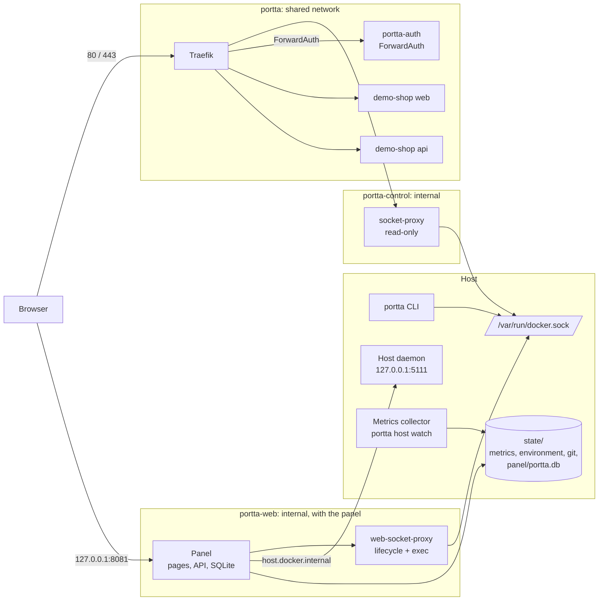
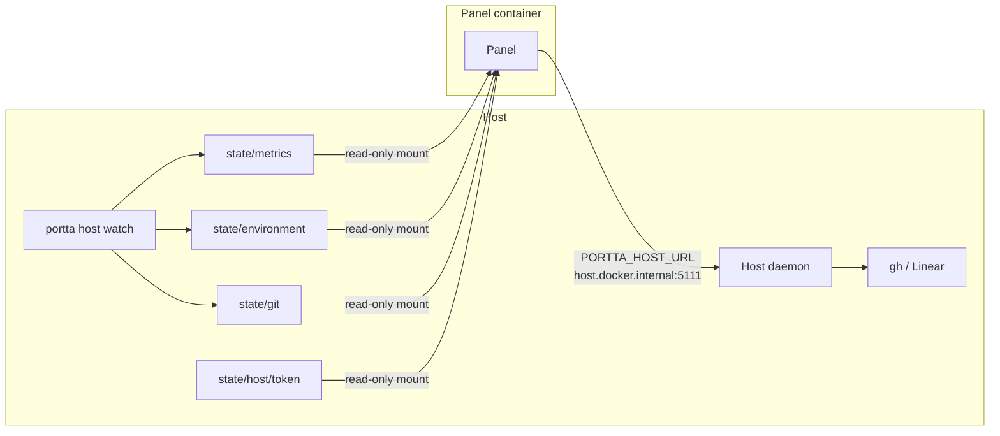
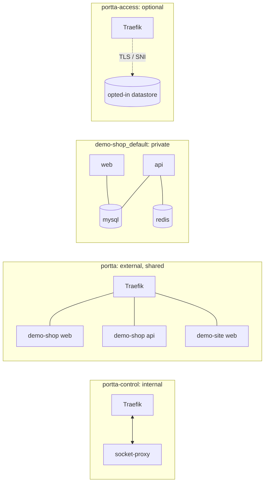

# Portta architecture

## The one idea

A container port and a host port are different things. Ten containers can all
listen on 3000 forever. The conflict only appears when something publishes
3000 *on the host*.

So the gateway publishes almost nothing. One router holds 80 and 443 for the
whole machine, and everything else is reached by hostname over a shared Docker
network.

## Overview



The panel container sits on both `portta` and `portta-web`; the diagram draws
it once. Project datastores such as `mysql` and `redis` stay on each project's
own private network and are not on this picture at all.

## Components

| Component | Where it runs | Role |
|---|---|---|
| Traefik (`traefik:v3.7.12`) | Container on `portta` and `portta-control` | The only process holding 80/443. Routes by hostname. |
| Docker socket proxy (`tecnativa/docker-socket-proxy:v0.5.0`) | Container on `portta-control` only | Read-only, filtered Docker API for Traefik's discovery. No host port. |
| `portta-auth` | Container on `portta`, part of the base gateway | ForwardAuth for protected *project* hostnames and shares: a login page and host-scoped sessions on port 4180, no published port. Not the panel's login. |
| Panel (`web`) | Optional container on `portta` and `portta-web` | One Node process: pages, the API, the event stream and WebSocket upgrades on one port. Opens its SQLite file itself. |
| Panel socket proxy (`web-socket-proxy`) | Container on `portta-web` only | The panel's own filtered Docker API: reads, the container lifecycle and four exec endpoints. |
| Applier (`portta-apply`) | Stopped helper container, no network | Prepared by `portta up` when `PORTTA_APPLY=true`; the panel starts it to run `portta up`. |
| Runner (`portta-runner`) | Stopped helper container, no network | Prepared by `portta up` when `PORTTA_RUNNER=true`; the panel starts it to run one Compose verb against one project. |
| Host daemon | Process on the host, `127.0.0.1:5111` | `portta host serve` or the `portta-host` user service. Reads and writes issues through `gh` and Linear; serves the Taskflow module. |
| Metrics collector | Detached process on the host | `portta host watch`: host and Docker metrics every 5 s, readiness every 5 min, `portta repos scan` every minute, into `state/`. |
| Access bridges | On-demand `alpine/socat` containers | `portta access open`: a loopback port into one project's private network, removed on close. |
| Toolbox | One-shot container | Pinned operational tools (`portta toolbox run`, database clients). |
| Tailscale (`tailscale/tailscale`) | Optional sidecar | With `TAILSCALE_ENABLED=true` on a remote profile, Traefik shares its network namespace and answers on the tailnet. |
| Cloudflare Tunnel (`cloudflared`) | Optional container on `portta` | With `CLOUDFLARE_TUNNEL_ENABLED=true`, carries HTTPS to Traefik with no open port. |

The applier and runner are created with `docker create`, outside the gateway's
Compose project, and hold the Docker socket; see
[Security](security.md#applying-settings-and-what-it-costs) for what that
grants.

For implementation boundaries and command development, see
[Monorepo layout](../../development/monorepo.md).

### The panel is one process

Pages, API, events and WebSockets all answer on one port, from one Node
process: a session cookie has one origin, and a panel split across two ports
would need a proxy in front of it to have one. A small HTTP server dispatches
`/api/*` to Hono, `/ws/*` to the authorised upgrade handler and everything else
to Next's App Router — see
[ADR 0036](../../development/adr/0036-next-app-router-and-the-custom-server.md).

It signs people in itself. `PORTTA_AUTH_MODE=disabled` (the default) answers
everybody as the local operator, and is accepted only with panel access `local`,
`tailscale` or `vpn`
([ADR 0051](../../development/adr/0051-authentication-is-optional-inside-a-trusted-network.md));
`required` gives it accounts, roles, sessions, `ptt_` tokens and an optional
second factor, all in its own database
([ADR 0035](../../development/adr/0035-authentication-lives-in-the-panel.md)).

That database is one SQLite file the same process opens,
`$PORTTA_HOME/state/panel/portta.db`, bind-mounted into the container. There is
no database container, no data network and no credential; migrations run under
a lock before the panel opens HTTP
([ADR 0037](../../development/adr/0037-sqlite-is-the-panel-database.md),
[Persistence](persistence.md)).

### What the panel reads from the host

The panel mounts no project directory. Host facts reach it as files and HTTP:



Whenever the panel is on, `docker/compose/features/panel-host.yaml` maps
`host.docker.internal` to the host gateway, sets `PORTTA_HOST_URL` and mounts
the daemon token read-only. On Linux the daemon must listen on the Docker bridge
address (`PORTTA_HOST_BIND`) for the container to reach it. See
[Host metrics](../reference/host-metrics.md) and
[Run the host daemon](../guides/host-daemon.md).

## Networks



**`portta`** is external, created by `bootstrap`, and shared by every project.
Its lifecycle is independent of both the gateway stack and the projects: it
survives `portta down` and is never removed automatically.

**`portta-control`** is created with `internal: true`, so it has no route off
the host. Only Traefik and the socket proxy are on it. This is what keeps the
Docker API away from anything that handles network traffic.

**`portta-web`** exists only when the panel is enabled. It is also
`internal: true`, and carries nothing but the panel and its own socket proxy.
The two proxies are separate because their permission sets are: Traefik's is
read-only, the panel's adds the container lifecycle
([ADR 0008](../../development/adr/0008-web-panel-socket-proxy.md)).

**`portta-access`** carries persistent TCP forwarders and, with `PORTTA_TCP=true`,
hostname routing for datastores. Traefik joins it and a datastore opts in by
joining it too, never the shared HTTP network. Traefik picks the backend from
the TLS server name, so PostgreSQL and Redis are told apart by hostname on one
host port each. See [Configure TCP routing](../guides/tcp-routing.md).

**`<project>_default`** is each project's own network, created by its own
Compose file. Databases, caches, queues and search live here and nowhere else.
Traefik has no route to these networks and never needs one.

A service that should be reachable through the gateway joins **both** its
private network and the shared one. Nothing else changes about it.

## How a request is routed

1. `demo-shop-web.localhost` resolves to `127.0.0.1` (see
   [Develop applications locally](../guides/local-development.md)).
2. Traefik, holding `127.0.0.1:80`, matches the `Host` header.
3. When the hostname is protected, Traefik first asks `portta-auth` through
   ForwardAuth and only forwards an authenticated request.
4. The matching router points at a service Traefik built from the container's
   labels, and dials the container **over the `portta` network**, pinned by
   `providers.docker.network` so a multi-homed container is never reached
   through a private network.
5. The application answers on its own internal port. Nothing was published.

## How a service is discovered

Traefik's Docker provider watches the event stream through the socket proxy.
`exposedByDefault=false` means a container is ignored unless it sets
`traefik.enable=true`.

For an opted-in container with no explicit rule, the hostname comes from
`providers.docker.defaultRule`, a template over the labels Compose already
injects ([ADR 0005](../../development/adr/0005-hostname-convention.md)):

```text
<com.docker.compose.project>-<com.docker.compose.service>.<domain>
```

So a project never writes its own name into a routing rule, and a new worktree
gets new hostnames by changing one environment variable.

## How the panel and remote access attach

The gateway's Compose model is `docker/compose/compose.yaml` plus overlays the
CLI selects from `.env`:

| Setting | Overlay | Effect |
|---|---|---|
| Profile `local` or remote | `attach/host.yaml` | Traefik publishes 80/443 on `PORTTA_BIND_ADDRESS` |
| Remote profile with `TAILSCALE_ENABLED=true` | `attach/tailscale.yaml` | Traefik runs in the Tailscale container's network namespace |
| `PORTTA_WEB=true` | `features/web.yaml`, `features/panel-host.yaml` | The panel, its socket proxy and its route to the host daemon |
| `PORTTA_WEB_EXPOSE=local` or `tailscale` | `features/web-bind.yaml` | Publishes the panel on `PORTTA_WEB_BIND_ADDRESS:PORTTA_WEB_PORT` |
| `PORTTA_WEB_EXPOSE=vpn` | `features/web-bind.yaml`, `features/web-vpn.yaml` | Also routes it at `PORTTA_WEB_HOST.<domain>` |
| `PORTTA_WEB_EXPOSE=public` | `features/panel-public.yaml` | Traefik's own `panel` entrypoint on the panel port |
| `PORTTA_WEB_EXPOSE=domain` | `features/panel-domain.yaml` | Routes it on `PORTTA_PANEL_ADVERTISED_HOST` |
| `PORTTA_TCP=true` | `features/tcp.yaml` | PostgreSQL and Redis entrypoints and the access network |
| `PORTTA_DASHBOARD=true` | `features/dashboard.yaml` | Traefik's dashboard on loopback |
| `CLOUDFLARE_TUNNEL_ENABLED=true` | `features/cloudflare-tunnel.yaml` | The `cloudflared` connector |

Profiles add only the keys they change
([ADR 0003](../../development/adr/0003-traefik-static-config-via-env.md)):

| Profile | Reachable from | TLS |
|---|---|---|
| `local` | loopback | off by default |
| `remote-private` | the tailnet or a VPN interface | optional |
| `remote-public` | the internet, opt-in | ACME |

## Lifecycle independence

This matters enough to be a design constraint rather than a nice property:

- `portta down` stops the gateway's own containers. Every application keeps
  running.
- `portta up` rediscovers whatever is already running.
- `portta restart` does not restart a single application container.
- Tearing down a project leaves the gateway healthy and the shared network intact.

`tests/e2e/lifecycle.test.sh` asserts it.

The panel may still **operate** a project on request, without owning it
([ADR 0030](../../development/adr/0030-the-panel-and-a-project-lifecycle.md)): start, stop and
restart by iterating the containers it can already see, and rebuild or take a
project down through the runner, whose command is fixed at creation.

## Ownership

Everything the gateway creates carries:

```text
portta.managed=true
portta.component=<traefik|socket-proxy|auth|web|web-socket-proxy|apply|runner|...>
```

Every path that stops or removes anything checks that label first. There is no
code path that can remove a consumer container, network or volume.

## What the gateway deliberately cannot do

It does not own a project's containers, volumes or release cycle. On request it
may start, stop or restart what it can see, in Compose dependency order, and it
may ask Compose to rebuild or take a project down through the runner. Rebuild
preserves volumes. Removal is two named modes — keep data, or include local
data — and the Compose project name is typed back, on the server. It cannot
repair a misconfigured project. `doctor` and `analyze` only observe.
