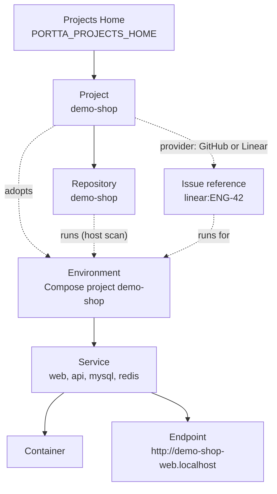

# Projects, environments and services

Portta separates what you **decided** exists from what Docker **observes**
running. A Project and its repositories are decisions, stored in the panel
database. Environments, services, containers and endpoints are observations,
read from Docker and the host scan every time. Portta has no Workspace entity:
the top of the model is Projects Home.



Solid lines are ownership; dotted lines are links Portta records or infers.

## Projects Home

One directory per installation, `PORTTA_PROJECTS_HOME` (default `~/projects`,
or `/srv/projects` as root). Project directories are its first-level children.
A repository sits either at a Project directory itself or one level below it,
so one directory can hold several repositories. `portta repos scan` reads it on
the host; the panel receives the path only as a string and never mounts it.
See [ADR 0031](../../development/adr/0031-projects-home-and-project.md).

## Project

The product you work on, such as `demo-shop`. Stored in the panel database with
a slug, a name, a description and, optionally, its first-level directory under
Projects Home (a relative path, never the identity). A Project does not
disappear when nothing is running.

It also records where its work lives: GitHub (derived from a repository's
GitHub remote) or Linear with a team key. See [Work and issues](work-and-issues.md).

## Repository

A Project's code: a name, a role, a local path and a remote URL. A local clone
with no remote is still a Repository. Git state — branch, commits, dirty files,
instruction files such as `AGENTS.md`, references to the decision records and
specification documents the project keeps — is collected on the host into
`state/git/` and read at request time, never stored in the database.

A repository may also declare what it is, in its own `.portta/` directory: the
Compose input set, which services have an HTTP surface, and the conventions its
worktrees follow. That description travels with the clone and never names a
host. See [The `.portta` directory](../reference/portta-directory.md).

## Environment

One Compose project, identified by its project name (`COMPOSE_PROJECT_NAME`).
That name is the namespace: it prefixes container names, networks, volumes and
hostnames. Each checkout or worktree needs its own, for example `demo-shop` and
`demo-shop-issue59`.

A Project **adopts** an environment. An environment belongs to at most one
Project, and Portta records why: a `portta.project` label, a matching
repository, a working directory under the Project's directory, or a manual
choice. The host scan also maps each environment to the repository it runs
from. Portta remembers an environment's working directory and Compose files so
it can be started again after its containers are gone.

## Service and container

A **Service** is one Compose service in an environment: `web`, `api`, `mysql`,
`redis`. Its **containers** are what Docker is running for it, with their state,
health and resource usage. Only HTTP services join the shared `portta` network;
`mysql` and `redis` stay on the environment's private network.

## Endpoint

How a service can be reached. A service has as many endpoints as the host's
capabilities and the operator's choices allow, each with a scope: internal,
local, LAN, private, protected or public. The default HTTP endpoint is derived
from the names:

```text
<compose-project>-<service>.<domain>   →   http://demo-shop-web.localhost
```

See [Addresses and access](addresses-and-access.md) and
[ADR 0024](../../development/adr/0024-capabilities-providers-endpoints.md).

## Where issues attach

Issues are not entities in Portta. An issue lives in GitHub or Linear and is
named by a reference such as `github:owner/repo#59` or `linear:ENG-42`. Portta
stores that reference in two places only:

- **the environment it runs for** — at most one issue per environment, many
  environments per issue, set by hand or inferred from the `portta.issue`
  label, the branch name or a namespace suffix such as `-issue59`;
- **work sessions and activity**, which name the issue they were about.

See [Manage projects](../guides/projects.md),
[Manage environments](../guides/environments.md),
[Work and issues](work-and-issues.md) and [Persistence](persistence.md).
