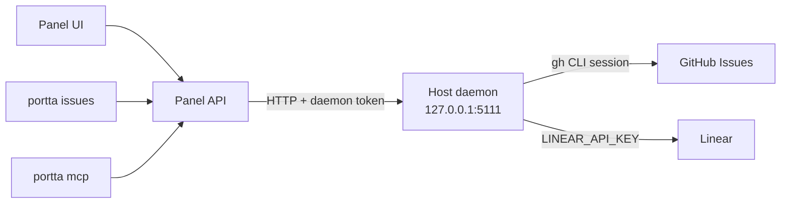

# Work and issues

A Project's work lives in GitHub Issues or in Linear. Portta reads and writes it
there, live, and keeps only a pointer to it and the one fact neither provider
knows: which environments on this host are running for which issue.

This page is the model behind that. For the day-to-day surface see
[Work with issues](../guides/issues.md); for the decision and its reasoning see
[ADR 0050](../../development/adr/0050-work-lives-in-an-external-provider.md).

## Where issues are read and written

The panel holds no forge credential. It asks the host daemon
(`portta host serve`), which runs on the host: GitHub through the operator's own
`gh` session, Linear through `LINEAR_API_KEY` in the daemon's environment. The
panel is always wired to the daemon while it runs; when the daemon is not
running, issue views say the provider could not be reached and everything else
keeps working. See [Run the host daemon](../guides/host-daemon.md) and
[Connect GitHub](../guides/github.md).

Reading needs `issue:read`; creating, editing, closing and commenting need
`issue:write`. The same operations are available as `portta issues` verbs and
as MCP tools.

## One provider per Project

A Project declares one place its work lives: `github` or `linear`. There is no
third, and no local mode.

The choice is usually not made at all. A Project whose repository has a GitHub
remote is a GitHub project, derived rather than configured, because the remote
already says so. The stored provider on the Project exists only to override that
— to choose Linear with its team key (such as `ENG`), or to choose GitHub for a
Project whose remote is somewhere else.

When neither applies, the panel refuses with a reason rather than answering an
empty list. "This Project has no repository with a GitHub remote", "this Project
uses Linear but names no team" and "this Project is not linked to anywhere its
work lives" are three different situations, and an operator fixes each of them
differently.

## The reference is the identity

Everything Portta stores about a piece of work is one string:
`github:owner/repo#113`, `linear:ENG-42`.

It is readable on purpose, because it ends up in rows nobody migrates: a work
session, an activity event, an environment link. It carries no database id, so
re-linking a repository or reconnecting a Linear workspace does not orphan
anything, and the same reference means the same issue on two hosts.

Parsing one is pure string work — no network, no token, no client — and Portta
refuses a reference it cannot parse rather than guessing.

## Nothing about an issue is persisted

A read is a call to the provider, projected into Portta's contract and answered.
There is no table, no cache and no synchronisation. In the vocabulary
of [what the panel persists](persistence.md), an issue is neither a decision nor
an observation Portta records — it is somebody else's record, read when somebody
looks at it.

The cost is a provider call per page and no offline reading. The benefit is that
there is no state to be stale and no conflict to resolve.

## What Portta adds

One thing, and it is the thing neither provider can know: **which of this host's
environments are running for which piece of work.**

An environment is linked to at most one issue; an issue may have many
environments. A link made by hand wins outright. Otherwise Portta infers one
from what the environment itself declares — its `portta.issue` label, then its
branch name, then its namespace suffix — in that order, first match winning. A
label carries a whole reference, because an environment has nothing to resolve
a bare number against; a branch (`feature/issue-113`) and a namespace suffix
(`-issue113`) carry only a number, read relative to the Project's GitHub
repository.

For example, the environment `demo-shop-issue59` of the `demo-shop` Project is
linked to issue 59 of that Project's GitHub repository unless a label or a
manual link says otherwise.

Work sessions and activity carry the same reference, which is how the panel
answers "who is working on this, since when, and what did they produce" without
holding the issue.

## Two providers, one shape

The two providers are implemented once each, with no plugin surface. Their
coordinates differ — a repository for GitHub, a team key for Linear — so every
issue operation takes a Project, and the Project decides which one applies.

The shape the panel renders is the **intersection** of the two providers: a
field exists when both can answer it, or when the one that cannot can answer
`null` honestly.

Open and closed is the clearest case. GitHub has those two words; Linear has
workflow states with a type, so Portta projects `completed` and `canceled` onto
`closed` and everything else onto `open`, and keeps the state's own name beside
it so a person still reads "In Review".

## What this trades away

- **The work surface needs the network, the host daemon and a signed-in host.**
  It answers a typed failure with a hint rather than an empty list, so a
  provider outage never reads as "there is no work". Everything else —
  Projects, repositories, environments, sessions, activity — is unaffected.
- **A comment is public.** Written through Portta, it is a comment on the issue,
  attributed to whoever is signed in on the host and visible to everybody on
  it. There are no private notes attached to work.
- **Subtasks, types, priorities, due dates and attachments are the provider's.**
  Portta neither adds nor emulates them.
- **There is no board.** Ordering is the provider's.
