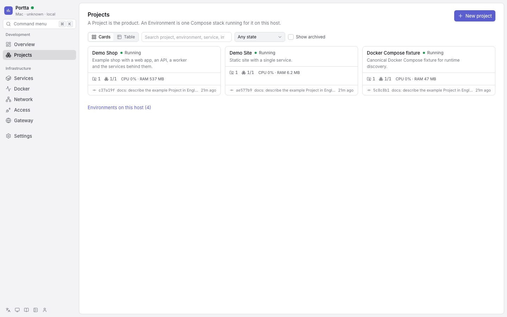
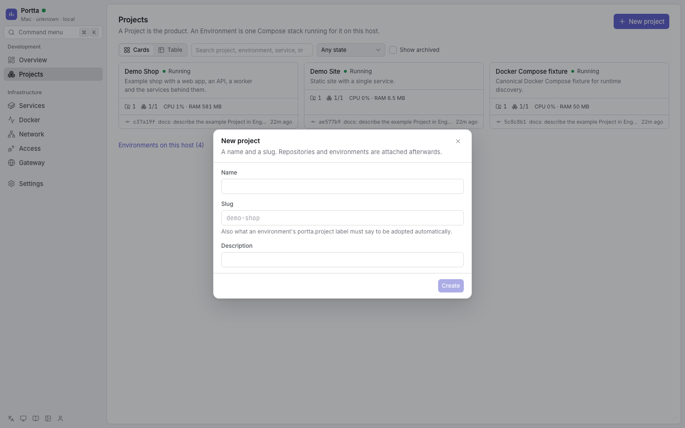

# Add your first project

A Project groups the repositories and environments that belong to the same
product. An Environment is one Compose namespace.

## Prerequisites

Complete [Configure your first environment](first-environment.md) and open the
panel with `portta web up` and `portta web open`. With authentication enabled,
sign in with an account allowed to create Projects.

## Create the Project

1. Open **Projects**. Existing Projects appear as cards; **Table** switches to a
   table.

   

   **Authentication disabled** — the Projects page.

2. Choose **Environments on this host** and find your environment, such as
   `demo-shop`. Verify its working directory and services belong to your
   checkout, then go back to **Projects**.
3. Choose **New project**, enter `Demo Shop` as the name and `demo-shop` as the
   slug, then choose **Create**.

   

   **Authentication disabled** — the New project dialog.

4. Open the Project. An environment whose services carry the
   `portta.project=demo-shop` label is associated with it; the label does not
   create the Project itself.
5. Inspect its **Environments** and **Repositories** tabs. If the environment has
   no label, use **Adopt an environment** on the Environments tab to select it
   explicitly, and **Add repository** to register the checkout.

The same Project can be created from the terminal:

```bash
portta projects create --slug demo-shop --name 'Demo Shop'
```

## Expected result

Your Project and its running environment are visible without moving the
repository or sharing another environment's state. If they are missing, use
[Troubleshooting](../guides/troubleshooting.md) and verify the labels described
in [Add an existing project](../guides/adopting-projects.md).

See [Manage projects](../guides/projects.md) for ongoing administration.
