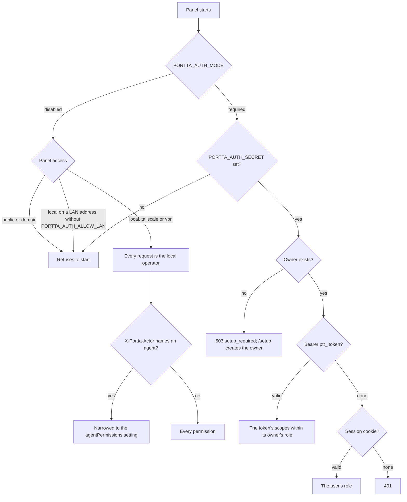
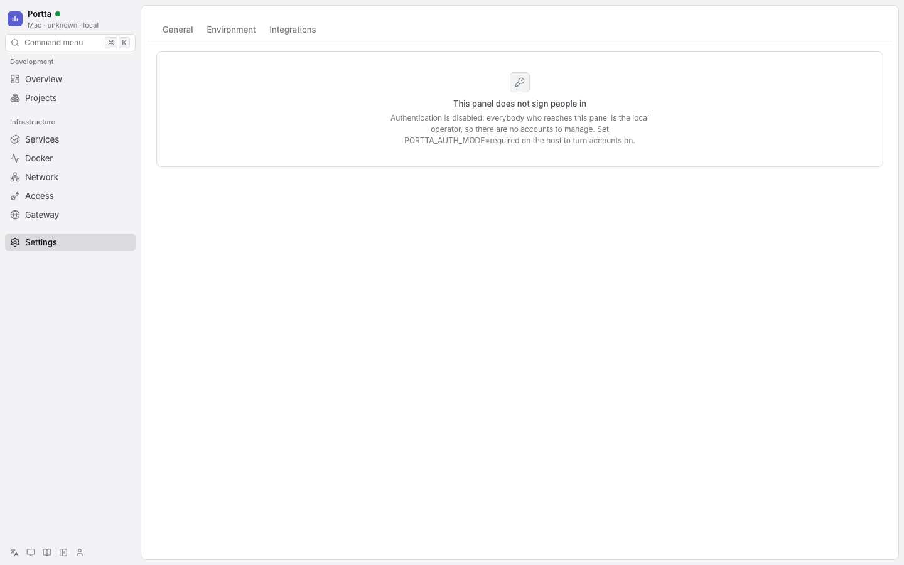
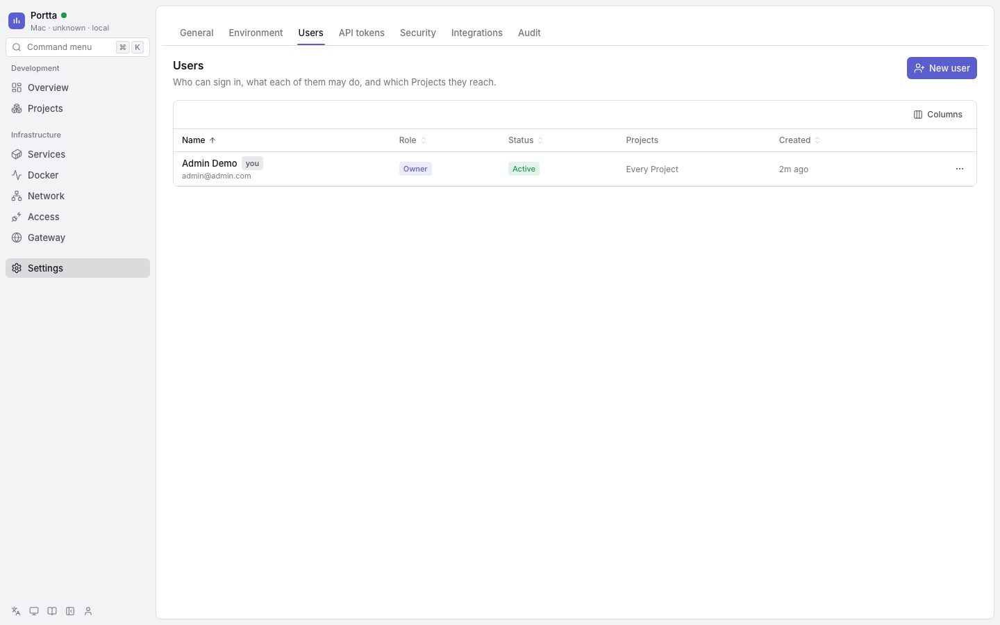
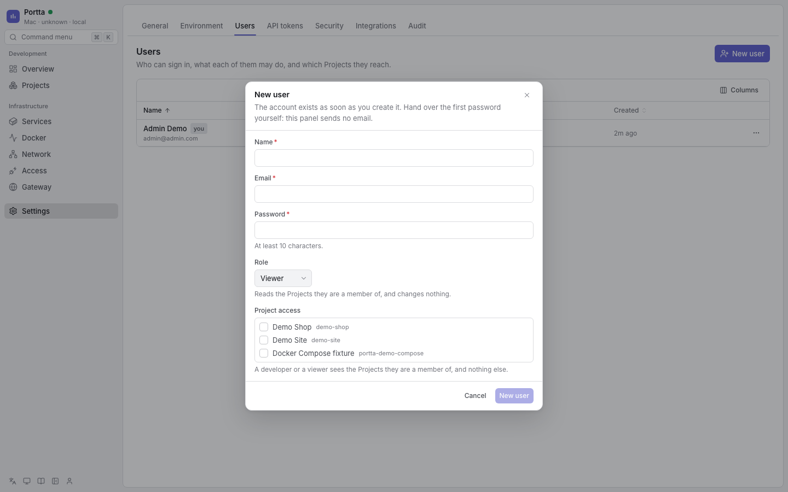
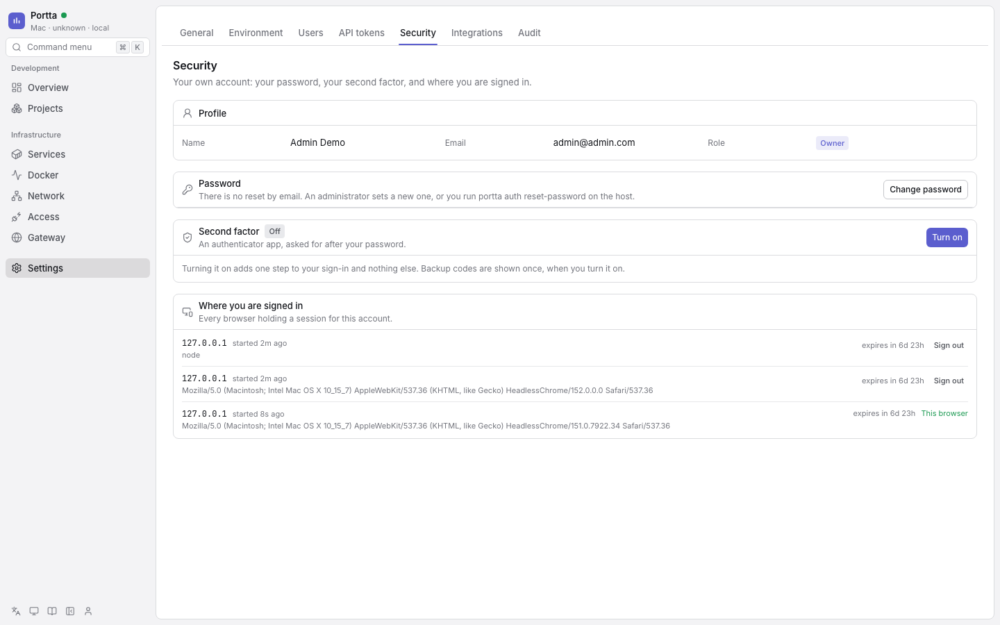
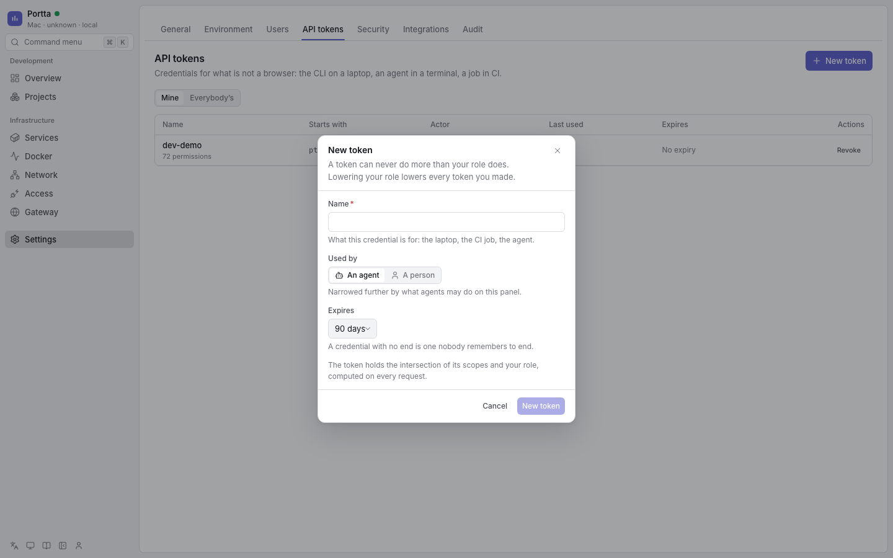
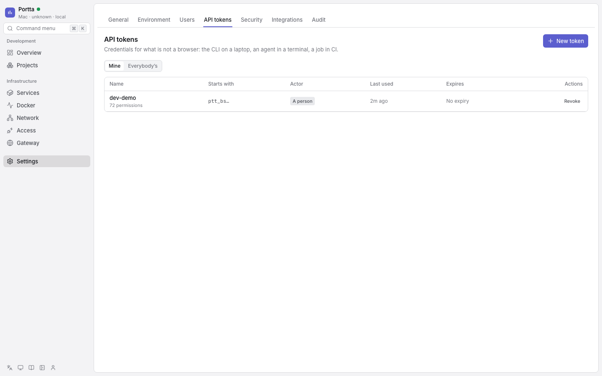
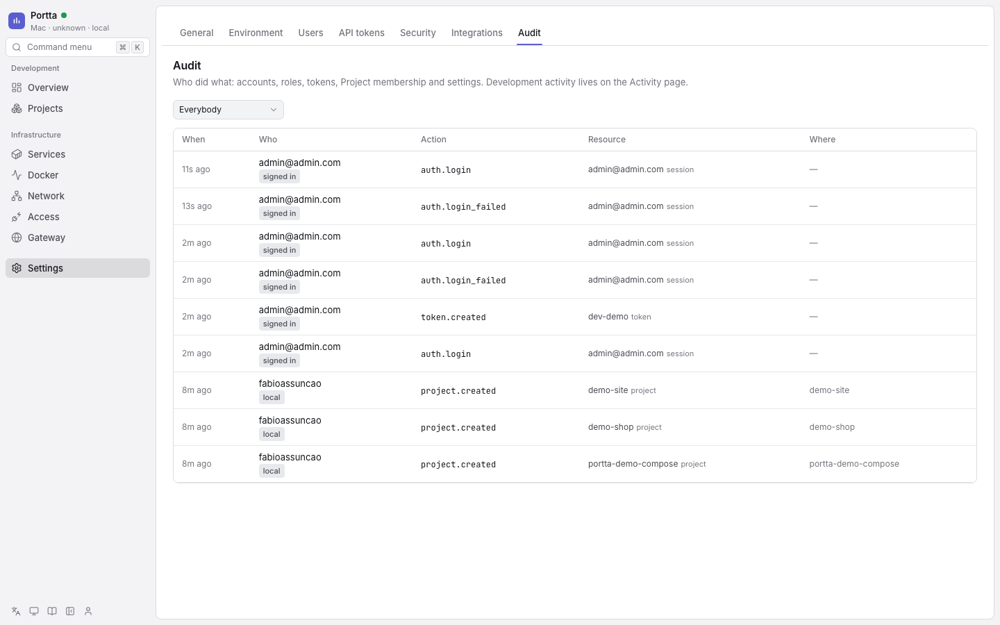

# Configure authentication

Portta answers two different questions with two different mechanisms.

**The panel** asks who *you* are — or, when authentication is disabled, does not
ask at all. When it asks, it signs people in itself: a session cookie issued by
the panel, a role that says what you may do, and optionally a Portta token for a
CLI or a coding agent. Nothing in front of the panel decides anything.

**A project hostname or a share** asks whether a request may reach an
application Portta routes but does not own. That is a separate process,
`portta-auth`, which Traefik consults through ForwardAuth before the application
receives anything. It is described in
[Project hostnames and shares](#project-hostnames-and-shares).

## Choose a mode

| `PORTTA_AUTH_MODE` | What it means |
|---|---|
| `disabled` (default) | Every request is the local operator, holding every permission on every Project. No accounts, no tokens, no sign-in. Accepted with panel access `local`, `tailscale` or `vpn`; refused at boot with `public` or `domain`. |
| `required` | Everybody signs in. `/setup` creates the owner; everyone else is created by an administrator. `PORTTA_AUTH_SECRET` is mandatory, and the panel refuses to start without it. |

Set it from the host. `portta config set panel.auth` and
`portta config set panel.access` each validate against the other, so a
combination the panel would refuse is refused in the terminal, with the command
that fixes it:

```bash
portta config set panel.auth required     # everybody signs in
portta config set panel.auth disabled     # refused under domain or public
portta config set panel.access public     # refused while nobody signs in
```

`portta web up` generates `PORTTA_AUTH_SECRET` when it is empty and never prints
it. `GET /api/auth/status` answers which mode a running panel is in, as `open`
(disabled) or `protected` (required), and whether it still needs an owner.

### How a request is resolved



Whichever principal comes out, read-only mode then leaves it the reads alone,
and every route checks the permission it declares (`403` when it is not held)
and, for a named resource, the Project it belongs to.

### Switching

Switching `disabled` → `required` on an existing installation costs nothing: the
next boot has no owner, so the panel offers `/setup`. Switching back is accepted
wherever the rule above accepts it; the users and their tokens stay in the
database, inert.

`portta doctor` grades the combination in three levels. It **fails** exactly
where the panel's own process would refuse to start. Everything Portta accepts
without a login is a **warning**: a tailnet or VPN panel warns and names the
assumption, a LAN panel warns and names the bind address. Only a loopback panel,
and a panel that signs people in, pass.

## Authentication disabled



**Authentication disabled** — Settings offers only General, Environment and
Integrations; a bookmark into Users says the panel does not sign people in.

`disabled` is the statement that reaching the panel already means being somebody
the network let in, and the access mode is the answer Portta has for that.
`local` is loopback, where reaching the panel means having the machine.
`tailscale` binds the node's tailnet address, which answers a device somebody
enrolled and an ACL admits. `vpn` routes the panel at a private name reachable
only inside the VPN. `portta web up` accepts `tailscale` and `vpn` with
authentication disabled, and warns that anybody who reaches the panel there is
the local operator.

`public` and `domain` answer whoever finds the address. There the panel's own
process refuses to start:

```text
PORTTA_AUTH_MODE=disabled is refused with panel access public, which answers
whoever finds the address; set PORTTA_AUTH_MODE=required, or use access local,
tailscale or vpn
```

`local` bound to something other than loopback is the LAN, and "everyone on the
office Wi-Fi" is not an authenticated set. Turning the login off there takes
`PORTTA_AUTH_ALLOW_LAN=true` in `.env` on the host. Without it the panel refuses
to start:

```text
PORTTA_AUTH_MODE=disabled with PORTTA_WEB_BIND_ADDRESS=192.168.1.20 offers the
panel to the local network, which is not an authenticated set; set
PORTTA_AUTH_MODE=required, or PORTTA_AUTH_ALLOW_LAN=true to accept that every
device on this network is the local operator
```

The security of a panel with no login is the tailnet's or the VPN's. A tailnet
ACL that admits a device admits an operator, and a stolen VPN profile is a
stolen panel. There is no per-user attribution without accounts: activity and
sessions record the local operator, and an installation that needs to know
*who* needs `required`.

### Agents

With no sign-in there is nobody to be, so `X-Portta-Actor` is attribution: it
says which caller behind the machine this is. The one thing it decides is that a
request announcing itself as an agent (an actor whose `X-Portta-Actor-Kind` is
not `human`, which is what `portta mcp` sends) is held to the
`agentPermissions` setting. Its default is a developer minus
`environment:settings` and `repository:manage`.

That setting is editable in **Settings → General → Panel**, one permission at a
time, and `GET`/`PUT /api/settings/agent-permissions` is the same list for a
script.

## Authentication required

### The first user

A panel in `required` mode with no owner has exactly one page. Every route
redirects to `/setup`, and the API answers `503 setup_required` to everything
except `GET /api/health`, `GET /api/auth/status` and `POST /api/auth/setup`.


**Authentication enabled** — `/setup` on a panel with no owner.

A server with no browser creates the owner from the host:

```bash
printf %s "$PASSWORD" | portta auth bootstrap \
  --name 'Ada Lovelace' --email ada@example.com --password-stdin
```

An installation never creates it. Checkout only: in `required` mode,
`just dev` creates the development owner `admin@admin.com` / `secret`.

The first account becomes the `owner`. Public sign-up does not exist, and the
panel refuses a second setup with `409`. The database holds at most one owner —
a partial unique index on the owner role — so two people opening `/setup` at the
same moment produce one owner and one `409`.

### Signing in


**Authentication enabled** — `/sign-in`.

A refused sign-in does not say which of the two fields was wrong:


**Authentication enabled** — a refused sign-in.

Sign-in, TOTP verification and backup codes are rate-limited to five attempts in
ten minutes, per address. A team behind one NAT is one address, which is what
`PORTTA_AUTH_SIGNIN_ATTEMPTS` is for; it accepts 3 to 100, and anything else is
read as the default. A user who has turned on a second factor is sent to
`/two-factor` after their password is accepted.

### Roles

| Role | Holds |
|---|---|
| `owner` | Everything. Exactly one, and the only one who can transfer ownership. |
| `admin` | Everything except acting on the owner. |
| `developer` | Works: issues, sessions, environments, services, containers, repositories, loopback bridges, their own tokens. Does not destroy, open a container console, change settings or administer accounts. |
| `viewer` | Reads, and their own tokens. |

Every API operation declares the permission it needs as `resource:action`, and
the OpenAPI document publishes it as `x-portta-permission`. A request with no
credential gets `401`; a request with one that is not enough gets `403`.

### The rules a role cannot express

Four things are true regardless of what somebody holds, because the owner is a
person rather than a permission. An administrator holds every statement the
owner does; these are the whole difference:

- **Nobody changes their own role, and nobody removes their own account.**
- **Only the owner acts on the owner** — no role change, ban, password or
  removal, whoever is asking.
- **`owner` is never assigned.** It moves through
  `POST /api/users/:id/transfer-ownership`, which promotes the target and demotes
  the caller in one transaction.
- **The last owner cannot be removed.**

Two more follow from where the accounts live. Setting somebody's password
revokes every session they had. And administering accounts needs a signed-in
person, not a machine token.

### Managing accounts



**Authentication enabled** — Settings, Users.

| What | Permission | Where |
|---|---|---|
| List, read | `user:list`, `user:get` | `GET /api/users`, `portta users list` |
| Create | `user:create` | `POST /api/users`, `portta users create` |
| Change a role | `user:set-role` | `PATCH /api/users/:id/role`, `portta users set-role` |
| Set a password | `user:set-password` | `PATCH /api/users/:id/password`, `portta users set-password` |
| Ban, unban | `user:ban` | `PATCH /api/users/:id/ban` |
| Remove | `user:delete` | `DELETE /api/users/:id`, `portta users remove` |
| See and end sessions | `session:list`, `session:revoke` | `GET`/`DELETE /api/users/:id/sessions` |
| Which Projects somebody reaches | `project:members` | `PUT /api/users/:id/projects`, `portta users grant`, `portta users revoke` |
| Hand the panel over | `user:set-role`, and only the owner | `POST /api/users/:id/transfer-ownership` |

**New user** takes a name, an email, a first password to hand over yourself —
the panel sends no email — a role and the Projects the account starts with.



**Authentication enabled** — creating an account.

Removing an account takes its sessions, tokens and memberships with it. The work
it did stays, under the name it was done with. An action a rule would refuse is
not offered in Settings → Users, and removing asks for the account's email to be
typed first.

### Access by Project

A role says what somebody may do. A membership says where. `owner` and `admin`
see every Project; a `developer` and a `viewer` see the ones somebody put them
in, and nothing else — not the issues, not the environments, not the activity,
not the events.

```bash
portta users grant  ada@example.com demo-shop
portta users revoke ada@example.com demo-shop
```

Every route that names a resource asks twice: the permission first, and the
Project second, once it is known which one the resource belongs to.

| Resource | Its Project |
|---|---|
| Project, repository, work session, activity | the row's own `project_id` |
| Issue | the Project whose provider it is read through; there is no global issue list |
| Environment, service, container, logs, per-environment resources | the Project that adopted the environment; **none** if no Project did |
| Bridge, forwarder, share | the environment it targets |
| Docker's raw host inventory, gateway, network, tunnel, settings, users, audit | nothing: they are about the host, and the permission decides alone |

An environment no Project adopted is visible to `owner` and `admin` and to
nobody else. The same is true of a repository the host scanned that nobody
registered, and of an event with no Project in it.

**Listings filter; named resources refuse.** Asking for the Projects returns
yours. Asking for one by name that you are not in is a `403`. The Overview sums
only what you can see, and the event stream delivers only events about it —
losing a membership takes effect on the next request.

Owner and admin see every Project, so setting a membership list for them is
refused, and promoting somebody to admin clears the memberships they had.

### Sessions and the second factor

Sign-in sets `portta.session_token`: `HttpOnly`, `SameSite=Lax`, `Path=/`, and
`Secure` whenever `PORTTA_PANEL_URL` is HTTPS. Sessions last seven days and are
refreshed daily. Signing out revokes the session; banning a user takes effect on
their next request.



**Authentication enabled** — Settings, Security.

**Settings → Security** is your own account. Turning on a second factor asks for
the password, shows the QR code and the secret behind it, and only counts the
factor as on once a code from the app comes back. The backup codes are shown
once. Turning it off asks for the password again. The same page lists every
session of the account, marks the current browser, and ends the others one at a
time. An administrator ends all of somebody else's sessions at once under
**Settings → Users**.

There is no email transport, so there is no reset link. A forgotten password is
reset from the host:

```bash
printf %s "$NEW" | portta auth reset-password ada@example.com --password-stdin
portta auth reset-password ada@example.com    # or let it generate one, shown once
```

That runs inside the panel's own container, where the database is, and needs the
panel running. It is deliberately not an API call: it exists for the case where
no credential works. Every session of that account is ended.

### Tokens for the CLI and agents

A Portta token is a `ptt_`-prefixed Bearer credential belonging to a user. It
never exceeds its owner's role: what it holds is the intersection of its own
scopes and that role, computed on every request. Lowering somebody's role lowers
every token they made; banning them stops all of them at once; revoking one
takes effect on the next request that carries it.

```bash
portta auth token create --name laptop --human    # the secret is shown once
portta auth token create --name ci --scopes issue:read,issue:write --expires-in-days 90
portta auth token list
portta auth token revoke <id>
```

Asking for no scopes gives the default for what the token is: a person's token
(`--human`) holds their whole role, and an agent's token holds a developer's
permissions minus `environment:settings` and `repository:manage`, within the
owner's role. Asking for scopes the owner does not hold is a `400` that names
which ones did not fit.

Your tokens are yours to make and revoke. Somebody else's needs `user:list` to
see (`--all`) and `user:update` to revoke.



**Authentication enabled** — creating a token in Settings, API tokens.

**Settings → API tokens** shows your tokens by default, and everybody's for
somebody with `user:list`. A new secret appears once, in a dialog that asks you
to confirm you copied it, because the panel keeps only a hash.



**Authentication enabled** — Settings, API tokens.

The panel accepts a token as `Authorization: Bearer ptt_…` and in no other
form. Housekeeping disables a token that expired more than thirty days ago and
deletes one revoked more than ninety days ago.

### Signing a terminal in

```bash
portta auth login --url http://127.0.0.1:8081     # asks for the token, without echoing it
portta auth status                                # which mode, and who this terminal is
portta auth logout
portta auth whoami                                # every panel this host has a credential for
```

`login` checks the token against the panel before saving it, so a typo fails
there rather than on the next command. It also takes `--token`. The store is
`~/.config/portta/credentials.json` (`$XDG_CONFIG_HOME` respected), mode 0600,
one entry per panel URL.

Every other command sends `PORTTA_TOKEN` when it is set, and otherwise whatever
`login` saved for that panel. `portta mcp` uses the same resolution. A panel in
`disabled` mode needs neither. A non-loopback panel URL still needs
`--allow-remote`, because that URL is where a credential would be sent.

`logout` forgets the credential; it does not revoke the token.

### Audit



**Authentication enabled** — Settings, Audit.

**Settings → Audit** lists who did what, newest first, filtered by account:
sign-ins, accounts, roles, tokens, Project membership, settings and lifecycle
operations. See [Configure the panel](panel-settings.md) and
[Security](../concepts/security.md#the-audit-log).

## Project hostnames and shares

`portta-auth` publishes no host port, has no Docker socket or database, and
mounts `state/auth/protections.json` read-only. Credentials use Portta's scrypt
format, and hashes never appear in generated Traefik YAML. This process knows
nothing about the panel, its users or its tokens.

A successful login there sets `__portta_session` as `HttpOnly`, `SameSite=Lax`,
`Path=/`, host-only, and `Secure` on HTTPS, for twelve hours. Each protected host
has an epoch; changing or removing its credential invalidates the sessions that
came before. `/__portta/auth` is reserved on every protected host, and only
same-host paths are accepted as redirects.

REST, health-check, SSE and WebSocket requests never receive a login redirect.
They get `401`; interactive authentication happens through the login page.

Failed logins are delayed progressively; five failures in ten minutes lock that
host/IP pair for fifteen minutes. Logs carry scope, client address and outcome —
never a password, cookie or Authorization value.

### Shares

```bash
portta share list
portta share revoke a7f3
portta share gc
```

Protected-share passwords are shown once. Rotation bumps the share epoch; revoke
and garbage collection remove its protection record. See
[Share a service](sharing.md).

### Protecting a project hostname

Portta never edits a consumer project's router. Create the host record, then opt
that router into the generated middleware in the project's own Compose file:

```bash
portta protect host demo-shop-web.example.com --project demo-shop --service web
```

```yaml
labels:
  - "traefik.http.routers.demo-shop-web.middlewares=portta-forward-auth@file"
```

Inspect or remove records without exposing hashes:

```bash
portta protect status
portta protect status demo-shop-web.example.com
portta protect remove demo-shop-web.example.com
```

Removing the record does not edit the project label. Until the label is removed,
the unresolved protection fails closed.

## State and recovery

- `PORTTA_AUTH_SECRET` in `.env` signs the panel's sessions and tokens, and the
  ForwardAuth process's cookies. `portta web up` generates it when it is empty.
  Rotating it signs everybody out of both.
- The panel's users, sessions and tokens live in its SQLite database,
  `state/panel/portta.db` ([Back up and restore the panel](backup-restore.md)).
- `state/auth/protections.json` holds project and share credentials. It is
  versioned, atomic and mode 0600.
- `config/traefik/dynamic/portta-auth.yaml` contains only services, routers and
  middleware — no credential material.
- `PORTTA_AUTH_ALLOW_LAN=true` is the named opt-in for a panel with no login
  bound to a LAN address. It is set in `.env` on the host and nowhere else, so
  the panel cannot grant it to itself.
- `portta doctor` checks the mode against the access mode and the bind address,
  the signing secret, the panel's SQLite database file, the ForwardAuth store
  and the auth container's health.

See [ADR 0035](../../development/adr/0035-authentication-lives-in-the-panel.md) for why the panel
authenticates itself, [ADR 0051](../../development/adr/0051-authentication-is-optional-inside-a-trusted-network.md)
for why a login is optional inside a network that already authenticates, and
[ADR 0027](../../development/adr/0027-forward-authentication-service.md)
for the ForwardAuth trust boundary.
