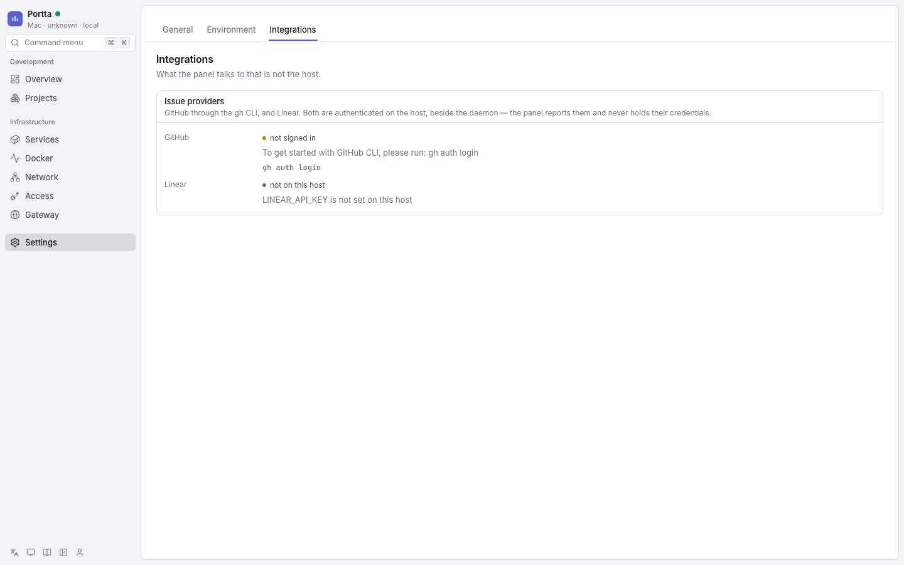
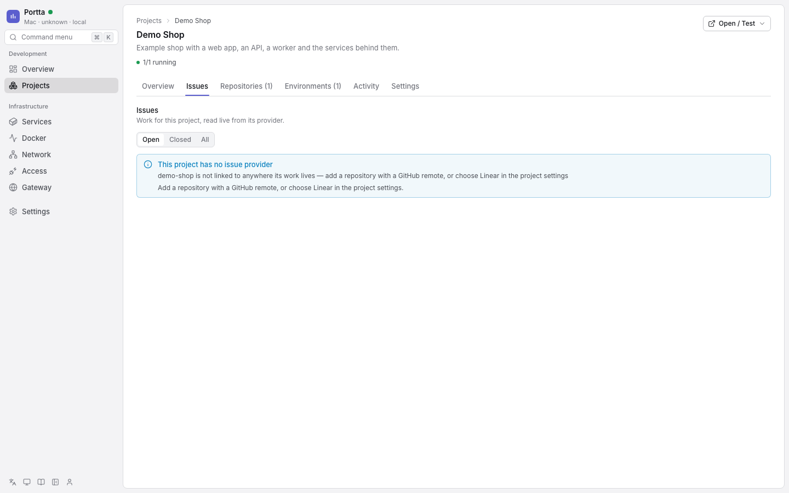

# Work with issues

Portta has no issue of its own. A Project's work lives in GitHub or in Linear,
and what Portta keeps is a reference to it — which provider, and which issue
there. The panel reads that issue when you open it, writes back to the provider
when you change it, and adds the one thing neither provider knows: which of this
host's environments are running for it. See
[ADR 0050](../../development/adr/0050-work-lives-in-an-external-provider.md).

## What a Project needs first

Issues are read and written on the host, not in the panel's container, so the
host daemon has to be running — [Run the host daemon](host-daemon.md). Then one
provider per Project:

| Provider | What the host needs | What the Project needs |
|---|---|---|
| GitHub | `gh` installed and `gh auth login` done | a repository whose remote is on GitHub |
| Linear | `LINEAR_API_KEY` in the daemon's environment | the team key, such as `ENG`, on the Project |

GitHub is the default and usually needs no decision at all: a Project whose
repository has a GitHub remote is a GitHub project without anybody configuring
it. The Project's stored provider exists only to override that — to choose
Linear, or to choose GitHub for a Project whose remote is somewhere else.

Three places report whether the host can operate either provider:

- `portta doctor` warns when `gh` is not installed, warns when it is installed
  but nobody is signed in, and passes with the signed-in account;
- the panel's own diagnostics stay silent about a provider that is not available
  on the host, warn when it is there but nobody is signed in, and pass with the
  account;
- **Settings → Integrations**, `portta issues status` and
  `GET /api/issues/status` show both providers with the fix for each. The status
  endpoint never fails — a diagnostic that fails is a diagnostic nobody can read.



**Authentication disabled** — Settings, Integrations.

## How Portta names an issue

One string, everywhere: `github:codions-labs/portta#113`, `linear:ENG-42`. It is
what a panel URL carries, what `--issue` takes on the command line, and what the
database stores on a work session, on an activity event and on an environment
link.

It is deliberately readable and deliberately not a database id, so it keeps
meaning the same thing after a repository is re-linked or a Linear workspace is
reconnected. Portta refuses a reference it cannot parse rather than guessing:
these strings arrive from URLs, arguments and agents, and one that parsed "close
enough" would address a different issue than the one somebody meant. A Linear
identifier is uppercased on the way in, because the API returns it that way and a
reference differing only in case would be a second row for the same issue.

Where a person reads it, the provider prefix is dropped: `portta#113`, `ENG-42`.

## In the panel

A Project's issues are at `/projects/:slug/issues`, and one issue at
`/projects/:slug/issues/:ref`. There is no global issue list and no way to name a
repository the panel is not linked to: every route is scoped to a Project,
because the Project is what decides which repository or team the request is
about. That scoping is also the authorisation boundary — somebody who cannot see
a Project cannot read its issues.

The list filters by state, and on GitHub also by assignee, label, milestone and
free text passed to GitHub's own search. Linear has none of those, and the panel
does not pretend otherwise. One listing is bounded at a hundred issues, which is
what a page shows.

A Project with neither a GitHub remote nor a Linear team has nowhere to read
issues from, and the tab says so with the fix:



**Authentication disabled** — a Project with no issue provider.

The same operations are on the command line:

```bash
portta issues list    --project demo-shop --state open --label bug
portta issues show    github:owner/demo-shop#113 --project demo-shop
portta issues create  'Checkout fails on empty cart' --project demo-shop --body-file notes.md
portta issues edit    github:owner/demo-shop#113 --project demo-shop --add-label bug
portta issues comment github:owner/demo-shop#113 'Fixed on the issue-113 branch' --project demo-shop
portta issues close   github:owner/demo-shop#113 --project demo-shop --reason completed
portta issues reopen  github:owner/demo-shop#113 --project demo-shop
portta issues status
```

## Open, closed, and what Linear actually has

Portta uses GitHub's vocabulary: an issue is `open` or `closed`.

Linear has no such thing. It has workflow states with a *type* — `triage`,
`backlog`, `unstarted`, `started`, `completed`, `canceled` — so Portta projects
`completed` and `canceled` onto `closed` and everything else onto `open`, and
keeps the state's own name beside it. You still see "In Review" rather than a
word Linear never used.

## Environments, which are Portta's own

GitHub does not know an environment exists. Linear does not either. "What is
this stack running for" is the question only Portta can answer, and it is the
one thing about work that stayed in the panel's database.

An environment is linked to at most one issue; an issue may have many
environments. A link that was made by hand wins outright. Otherwise Portta
infers one, in this order, first match winning:

| Signal | Example | Why it is ranked there |
|---|---|---|
| The `portta.issue` label | `portta.issue=github:owner/repo#113` | Somebody wrote it deliberately, and it carries a whole reference |
| The branch name | `feature/issue-113`, `113-fix-the-thing` | A convention people follow, carrying only a number |
| The namespace suffix | `demo-shop-issue113` | Generated by a tool, carrying only a number |

The order is the order of deliberateness. The label carries a full reference
because an environment is not inside a Project and has nothing to resolve a bare
number against. A branch and a namespace carry only a number, so they are read
against the GitHub repository of the Project that adopted the environment and
always produce a `github:` reference; when that Project has no GitHub repository
they produce nothing. A Linear
issue is linked only through the `portta.issue` label or by hand.

## Sessions and activity

`portta sessions start --issue <ref>` says who is working on what, and
`portta activity --issue <ref>` shows what happened around it. Both store the
reference rather than a foreign key, so they survive an issue Portta never held
and a provider Portta cannot reach.

A comment written through Portta is a comment on GitHub or on Linear, posted
under the account signed in on the host and visible to everybody on the issue.
There is no private note attached to work.

## The API

Seven routes, six of them under a Project, sharing the `issue:read` and
`issue:write` permissions:

| Route | What it does |
|---|---|
| `GET /api/projects/:slug/issues` | List, with the filters above |
| `GET /api/projects/:slug/issues/:key` | One issue, with its comments and its environments |
| `GET /api/projects/:slug/issues-vocabulary` | The labels, assignable people and milestones the provider offers |
| `POST /api/projects/:slug/issues` | Open one |
| `PATCH /api/projects/:slug/issues/:key` | Change title, body, state, labels, assignees or milestone |
| `POST /api/projects/:slug/issues/:key/comments` | Comment |
| `GET /api/issues/status` | Whether this host can operate either provider, and what is missing |

`:key` is the provider's own identifier — an issue number on GitHub, `ENG-42` on
Linear. A `PATCH` that changes both state and fields applies the fields first,
because state is a separate operation: reopening and retitling in one request
should leave the title changed even if the reopen is refused, not the other way
round.

The shape you get back is the intersection of the two providers rather than the
union. A field is there when both can answer it, or when the one that cannot can
answer `null` honestly. Nothing in it carries a Portta id, because the reference
is the identity and it is the provider's.

## When it does not work

Nothing is cached, so a provider that is unreachable means a page that cannot be
drawn. Portta answers a typed failure rather than an empty list, because "GitHub
is down" must never look like "there is no work here":

| What happened | Status | What fixes it |
|---|---|---|
| `gh` is not installed on the host | 503 | Install it, then `gh auth login` |
| Nobody is signed in | 401 | `gh auth login` on the host, or set `LINEAR_API_KEY` |
| Signed in, but not for this repository | 403 | An account that can see it |
| No such repository or issue | 404 | Check the reference — GitHub answers 404 for a private repository you cannot see, so this is more often permission than typo |
| The provider is rate-limiting | 429 | Wait; the limit is the operator's personal one |
| The call took too long | 504 | Retry |
| The provider failed | 502 | Read the message; it is the provider's own |
| The host daemon is not reachable | 503 | `portta host serve`, or `portta host service install` |
| The Project names nowhere its work lives | 409 | Add a repository with a GitHub remote, or choose Linear and its team |

Each of these keeps its own status and its own hint all the way to the browser,
because each is fixed a different way. Collapsing them into one "request failed"
is how somebody ends up re-authenticating to fix a 404.

## What Portta deliberately does not do

- **No board.** Ordering is the provider's, which on GitHub means its own filters
  and nothing else.
- **No subtasks, types, priorities or due dates of its own.** Whatever the
  provider offers is what you get; Portta neither adds nor emulates them.
- **No attachments.** Files belong on the issue, in the provider.
- **No mirror, and therefore no offline reading.** An issue read twice is fetched
  twice. Everything that does not need the forge — Projects, repositories,
  environments, sessions, activity — keeps working when it is unreachable.
- **No separate agent path.** `portta mcp` exposes `list_issues`, `get_issue`,
  `create_issue`, `update_issue` and `comment_on_issue`, which call the same
  routes with the same permissions. An agent can also read the Development
  Context (`portta projects context <slug> --issue <ref>` includes one issue in
  full). See [MCP](../reference/mcp.md).

## See also

- [Connect GitHub](github.md) for installing and signing in `gh` on the host.
- [Work and issues](../concepts/work-and-issues.md) for the model behind this.
- [Run the host daemon](host-daemon.md), which is what actually makes the calls.
