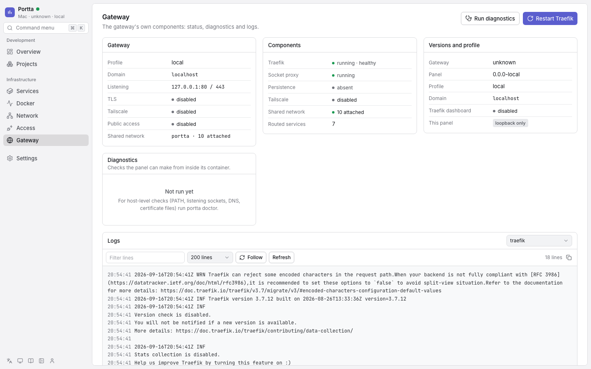
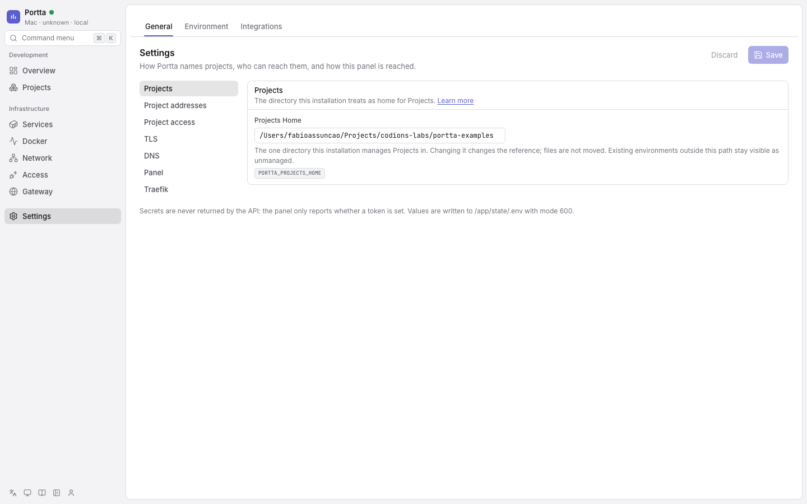
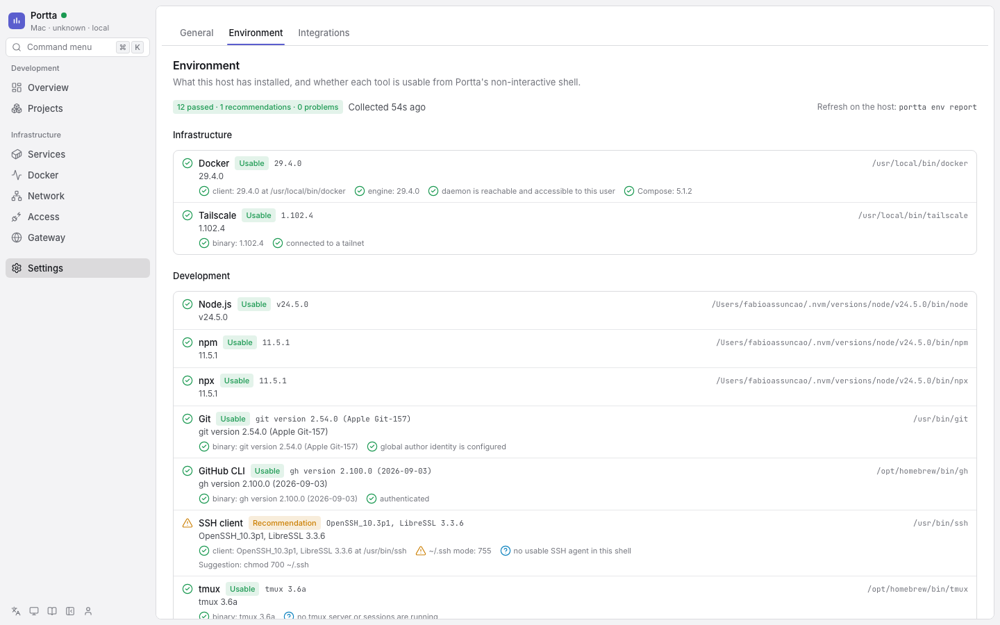

# Configure the panel

## Gateway

Component states, versions, the profile, diagnostics, and logs for Traefik, the
socket proxy and Tailscale.

**Diagnostics are not `portta doctor`.** They are the checks a container
can make honestly: components present and healthy, the shared network, services
that opted into Traefik but never joined it, hostname collisions, port
conflicts, stale bridges, unhealthy containers, and configuration that would
refuse to start. `doctor` runs on the host and additionally sees `PATH`,
listening sockets, DNS resolution and certificate files, which this process
cannot see truthfully. The panel says so and points at the command.

**Authentication disabled** — the Gateway page.

## Settings

Settings is a place with seven sections, and which of them somebody sees
depends on what they hold. The rail lists only the ones they can open;
`/settings` itself redirects to the first of them, so an owner lands on
General and a viewer lands on their own tokens. A panel with
`PORTTA_AUTH_MODE=disabled` has no accounts, so Users, API tokens, Security
and Audit are not offered at all — and a bookmark into one of them says the
panel does not sign people in rather than showing an empty table.

| Section | What it is | Who has it |
|---|---|---|
| General | How Portta names projects, who can reach them, and how this panel is reached | `settings:read` |
| Environment | Host environment readiness, host security findings, and Portta-owned SSH keys | `metrics:read` |
| Users | Accounts, roles, Project access, ownership | `user:list` |
| API tokens | The credentials that are not a browser | `token:read` |
| Security | Your own password, second factor and sessions | anybody signed in |
| Integrations | Whether this host can read and write issues, and what is missing | `issue:read` |
| Audit | Who did what, newest first | `audit:read` |

**General** is the settings people actually change. The groups follow three
decisions that stay independent: how projects are named, who can reach Traefik,
and how this panel is reached. The conceptual map is
[Addresses and access](../concepts/addresses-and-access.md). Each group has a stable
deep link, such as `/settings/general/tls` or
`/settings/general/project-access`. Moving between groups keeps one shared
draft; badges identify unsaved work in another group and Save writes every
changed key in one transaction. A key that is not in the catalogue cannot be
read or written through the API, whatever a request asks for.

**Authentication disabled** — Settings, General.

Gateway, public access and VPN are one **Project access** group. The form writes
their existing environment keys together so an operator cannot select a public
profile while leaving the public access decision or bind address behind.

The Traefik group shows the dashboard's status, every address that applies,
and an Open action that is enabled only when an endpoint is usable. The
dashboard stays on loopback under the normal host attachment: it has no login
of its own. The panel warns when a Tailscale attachment also exposes it on the
tailnet. Changing
`PORTTA_DASHBOARD` needs the gateway recreated; the apply bar at the bottom
is how that happens.

The Panel group also carries **what a local agent may do**: the
`agentPermissions` setting, ticked one permission at a time, with the default
in force until somebody narrows it. With authentication disabled it is what a
request that announces itself as an agent through `X-Portta-Actor` holds; it can
only take away, never add
([Authentication](authentication.md#agents)).

**Environment** shows the host environment readiness report (`portta envs report`),
grouped as infrastructure, development and agents, plus a host security summary
and Portta-owned SSH keys — generated or imported, tested against a forge, and
never leaving the host unencrypted. See
[Host environment readiness](../reference/host-readiness.md) and
[SSH keys owned by Portta](ssh-keys.md).

**Authentication disabled** — Settings, Environment.

**Users** lists who can sign in with their role, whether the account is usable,
and the Projects it reaches. Creating one hands over the first password on the
spot: this panel sends no email. The row menu carries the role, a password
reset, Project access, the open sessions, the ban and the removal — each of
them absent rather than disabled when the rule behind it would refuse
([Authentication](authentication.md#the-rules-a-role-cannot-express)). Removing
asks for the email to be typed. Transferring ownership is offered to the owner
alone, and never on their own row.

**API tokens** shows yours by default; an administrator can switch to
everybody's. A new token's secret appears once, in a dialog that does not close
on an escape key: the panel keeps a hash, so a lost secret means making another
token. Revoking says what stops working before it does it.

**Security** is your own account. Changing your password signs you out of every
other browser. Turning on a second factor asks for your password, shows the QR
code (and the secret, for an app that cannot scan it), verifies one code from
the app, and then shows the backup codes once. The session list marks the
browser you are reading it in and signs the others out one at a time.

**Integrations** has nothing to edit. Both providers a Project's work can live
in are authenticated on the host — `gh auth login` for GitHub, `LINEAR_API_KEY`
for Linear — and the panel is a container that can hold neither credential. What
the page does is say which of the two is reachable, name the account it is
signed in as, and give the command that fixes the one that is not
([Connect GitHub](github.md), [Work with issues](issues.md)).

**Authentication disabled** — Settings, Integrations.

**Audit** is who did what: sign-ins and failed sign-ins, accounts, roles,
tokens, Project membership, settings, and every lifecycle operation on an
environment or a container. Newest first, filtered by account, paged backwards.
Development activity — work sessions, commits, what happened around an issue —
is not in it and lives on the Activity page instead, and no password, token or
other secret value is ever written to it
([security](../concepts/security.md#the-audit-log)).

The Users, API tokens, Security and Audit sections are shown in
[Authentication](authentication.md).

