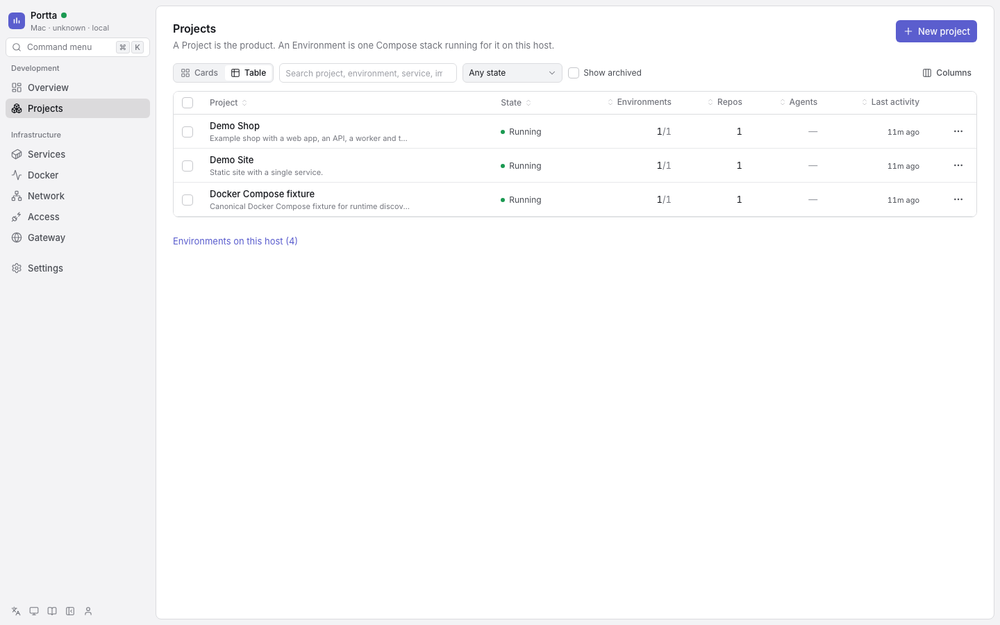
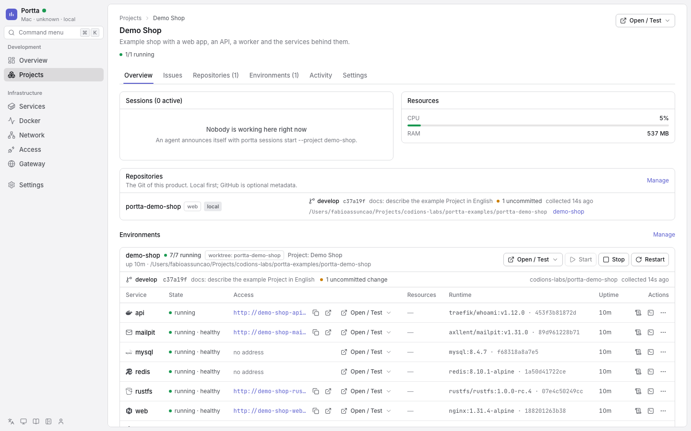
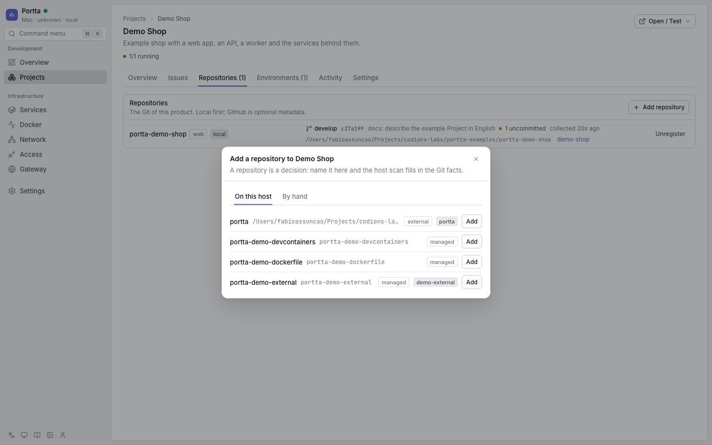

# Manage projects

## Projects

Every page below is a route, not a tab held in memory: `/projects`,
`/projects/<slug>`, `/projects/<slug>/issues`, and so on. Each one is a link
somebody can paste, a bookmark that survives a reload, and a step the browser's
back button walks. What a role may not do is not shown rather than shown
disabled — the exception is an issue's own controls, which stay visible and
inert, because an issue's state is information a viewer came to read.

**Authentication disabled** — Projects as cards.

The products you recognise, as cards or as a table: repositories, who is
working, running environments, health, last commit and last activity.
**New project** creates one from a name, a slug and a description; the slug is
also what an environment's `portta.project` label must say to be adopted
automatically. A Project needs the panel's database and the page says so when it
is unavailable. `Environments on this host` opens the list of every
Compose project Docker is running, adopted or not.

Both views are places to act, not only to look. A card carries the one action
its state allows — start what is stopped, stop what is running — and a menu
with the rest: issues, repositories, environments, settings, archive, delete.
An action that could not change anything is not offered.

**Authentication disabled** — Projects as a table.

The table sorts on any column, hides the ones a given host does not care about,
and selects rows for a bulk start, stop, restart or archive. The arrangement is
remembered per table. Nothing destructive happens without saying what it will
do: stopping a project names its environments and counts its containers,
and deleting one asks for its slug and states what survives.
The panel classifies a Project's location against Projects Home by comparing
paths the host scan reported; it never mounts Projects Home or any project
directory.

Opening a Project is the cockpit. The header carries its health, its sessions
and an **Open / Test** menu for its primary environment; below it, tabs that are
URLs:

| Tab | What it holds |
|---|---|
| **Overview** | The active sessions, the repositories with their git state, the environments with their services and an Open / Test each, the recent activity, and the resources the project uses |
| **Issues** | The issues this Project's work lives in, read from GitHub or Linear ([Work with issues](issues.md)) |
| **Repositories** | Each repository as a row; **Add repository** offers what the host scan discovered, or a path typed by hand |
| **Environments** | The environments adopted, why each was adopted, and **Adopt** for one that was not |
| **Activity** | The timeline: sessions, environments started and stopped, commits the scan noticed |
| **Settings** | Name, description, issue provider and Linear team, place under Projects Home, archive, and delete — which removes what only Portta holds and names it |

**Authentication disabled** — the Overview tab of a Project.

**Add repository** offers the repositories the host scan found on this host, or
a path typed by hand:

**Authentication disabled** — adding a repository to a Project.

## Repositories

`/projects/<slug>/repositories/<id>` is one repository: branch, HEAD, the
working tree spelled out, ahead/behind, the remote, the directory on the host,
and three tabs — the overview with open pull requests and the environments
running from it, the last twenty commits, and the **instruction files** the
host collected (`AGENTS.md`, `CLAUDE.md`, `.cursor/rules/*.mdc`, …) with their
content and whether they differ from HEAD. The same scan references the
**decision records and specification documents** the repository keeps — ADRs
under `docs/**/adr/`, an `openspec/` tree, a Spec Kit tree — by path, title
and hash, without copying their content; `GET /api/repositories/:id/specifications`
and `portta repos specs` list them, and the Development Context carries them
per repository.

None of it is live. `portta repos scan` collects it on the host and the
metrics watcher repeats it once a minute; every block says how old it is and
carries the command that refreshes it. See
[ADR 0010](../../development/adr/0010-git-collected-on-the-host.md) and the amendment in
[ADR 0032](../../development/adr/0032-portta-development-model.md).
