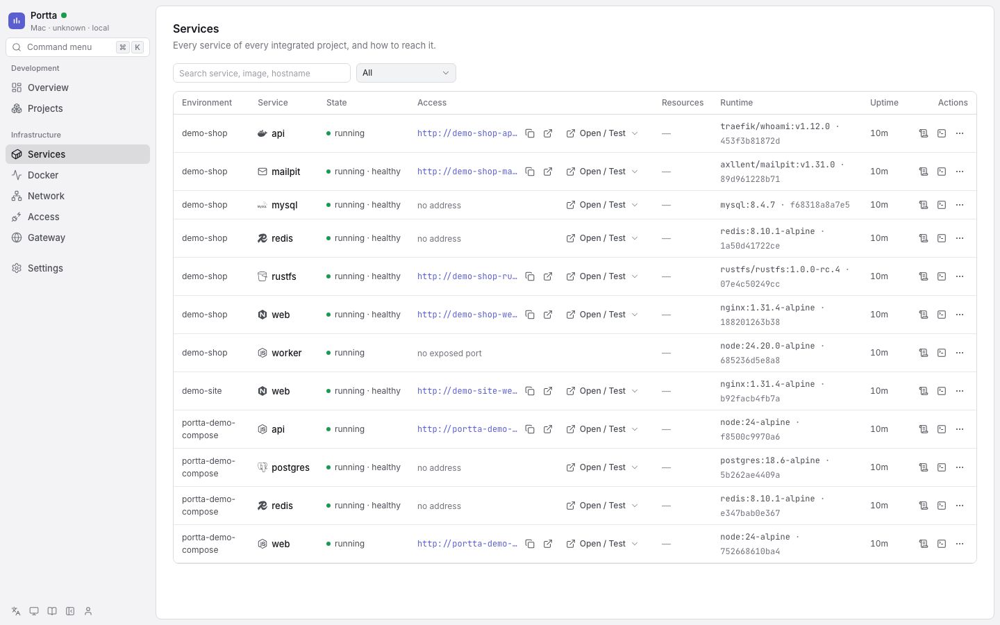
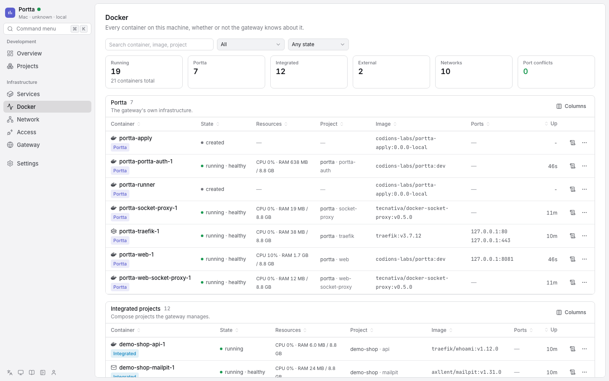

# Manage services

## Services

Every service of every integrated project as a flat, filterable list: image,
type, status, health, container port, and the addresses it answers on, split
into **Local**, **VPN** and **Public**. Every address has a copy button.

Addresses come from the same Docker labels Traefik routes on, so what the panel
prints is what Traefik serves. An explicit ``Host(`...`)`` label wins over the
derived hostname, exactly as it does inside Traefik.

**Authentication disabled** — the Services page.

## Docker

Every container on the host, in four clearly separated sections:

| Section | What it means |
|---|---|
| **Portta** | The gateway's own infrastructure. Managed by the CLI, not from here |
| **Integrated projects** | Compose projects connected to the gateway |
| **External Docker** | Compose projects the gateway does not manage |
| **Standalone containers** | Started by hand, outside any Compose project |

They are never mixed into one list. An external container is shown for
diagnosis, not because the gateway has any opinion about it: no URLs, no DNS,
no bridges, no gateway actions. Just what it is, what it holds, and the few
operations below.

**Authentication disabled** — the Docker page.

Below the sections, a host summary: engine and resources, container counts by
section, networks, and every published port with the container holding it.
Ports claimed by two containers are flagged, which is usually the answer to
"why will this not start".

Filters: All / Portta / Integrated / External / Standalone, crossed with
Any state / Running / Stopped / Unhealthy, plus a search over container name,
image, project, service and hostname.
