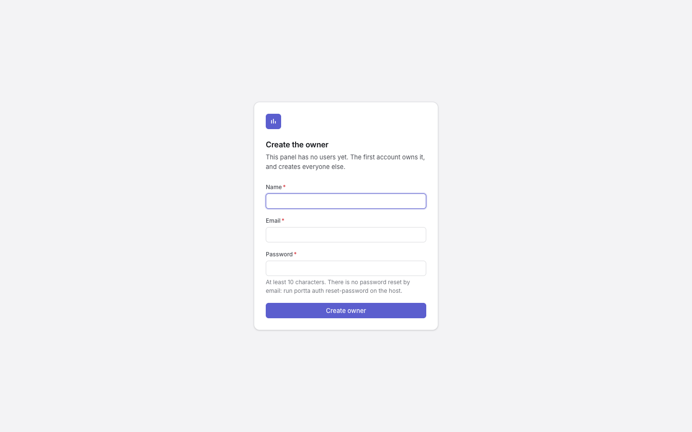
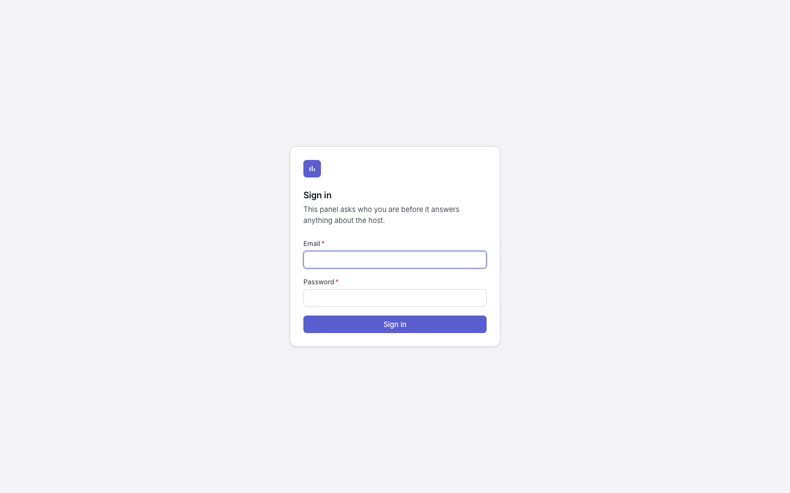
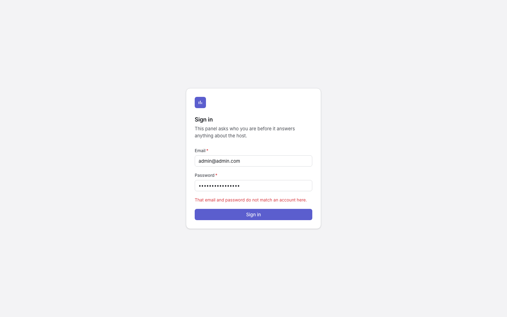
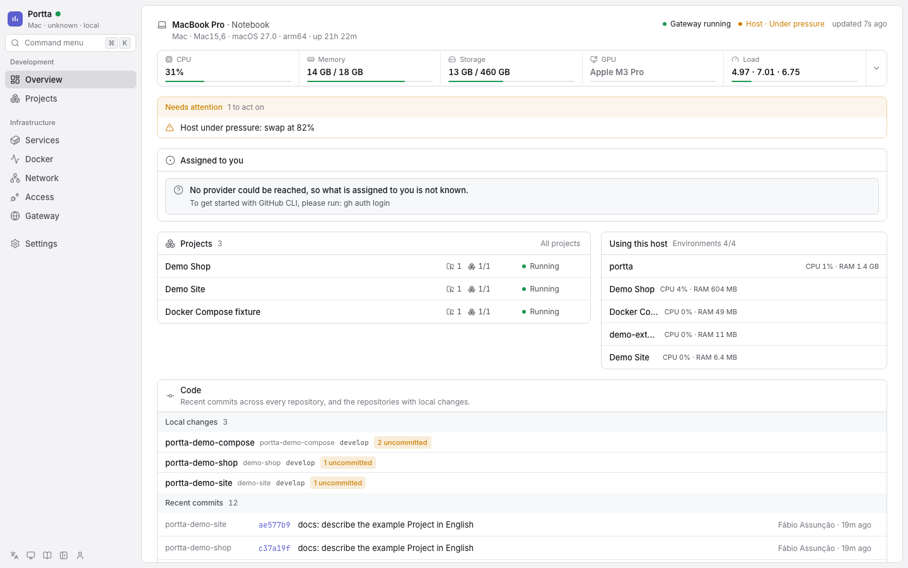
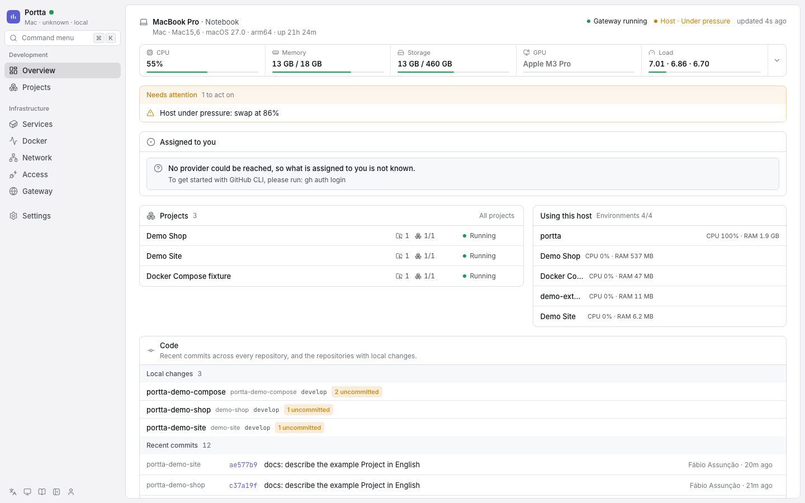
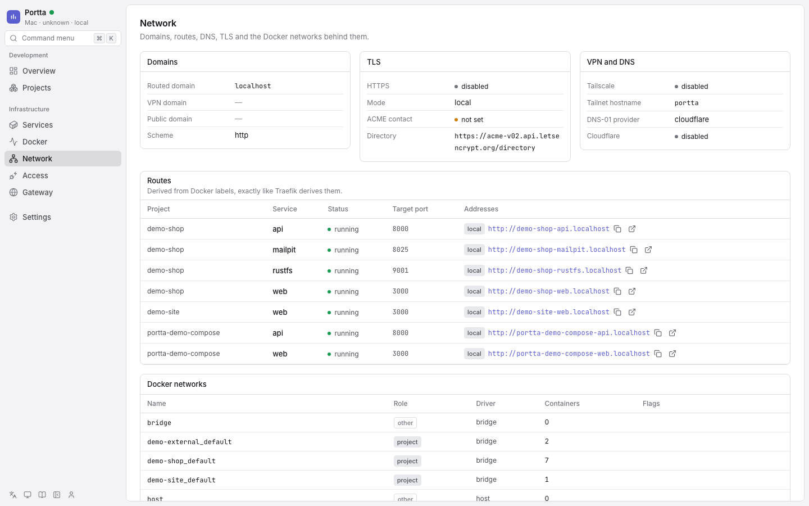
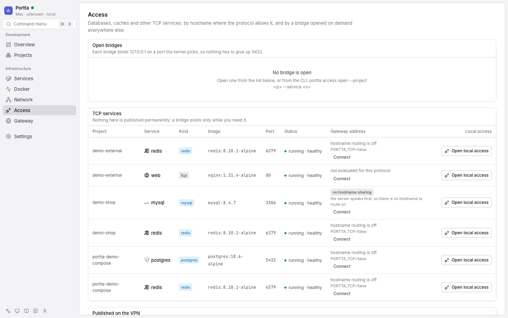
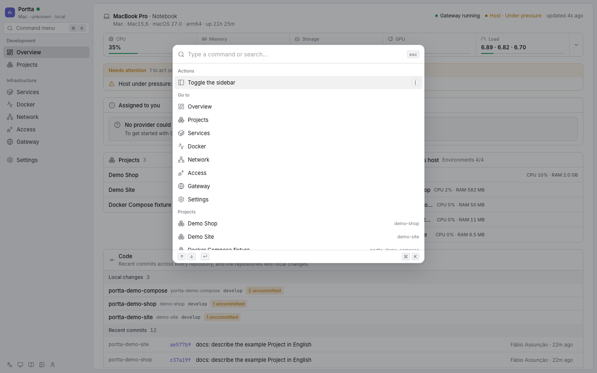
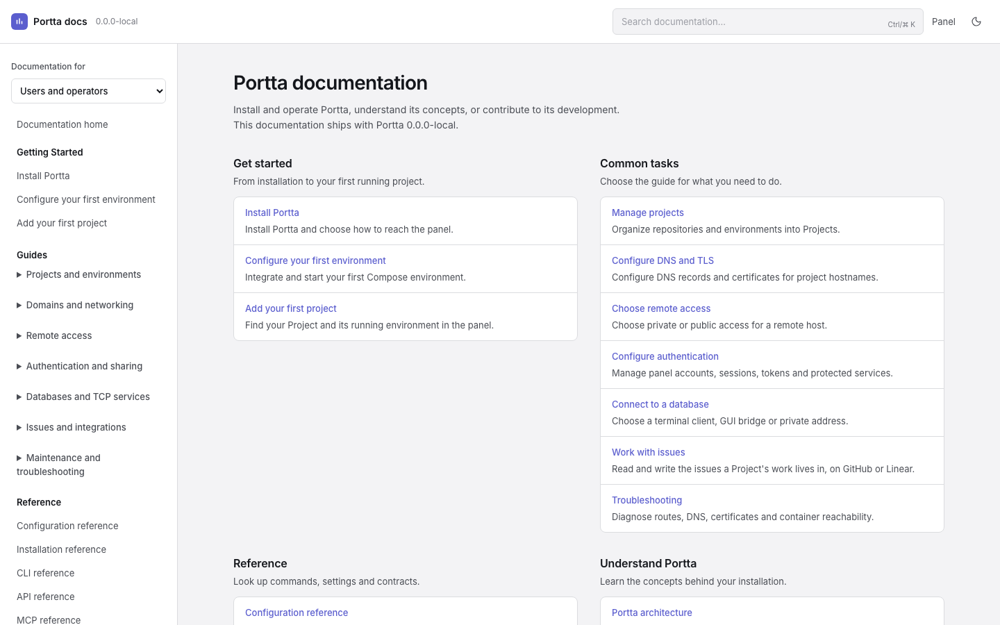
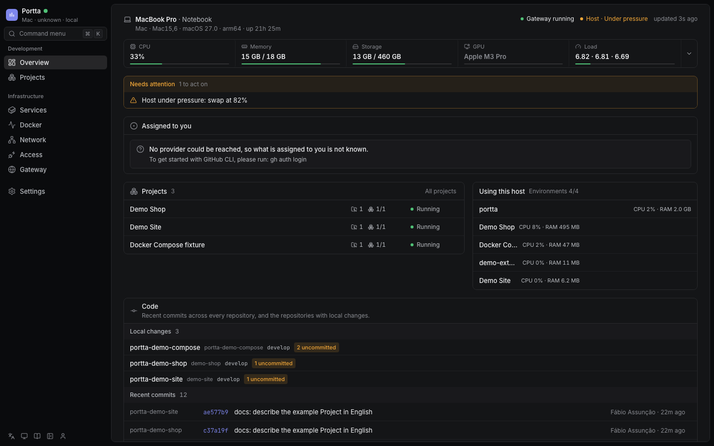

# Use the web panel

The panel is where a development host is opened: which Projects it carries,
which repositories and environments make them up, what is running, how to reach
and test it, what the logs say and how much of the host it uses. It complements
the CLI and `portta mcp` rather than replacing them: all three work on the same
API and the same model
([ADR 0032](../../development/adr/0032-portta-development-model.md)). Docker and
Traefik remain the live sources of runtime facts; the panel persists the
decisions — Projects, repositories, sessions — and a bounded history of what
happened ([ADR 0013](../../development/adr/0013-what-the-panel-persists.md)).

It is off by default.

```bash
portta web up
portta web open      # http://127.0.0.1:8081
```

Every screenshot on this page shows the demo host, rendered by the real panel
at 1440×900. The page walkthrough shows a panel with **Authentication
disabled**, the default; [Signing in](#signing-in) shows the same panel with
**Authentication enabled**.

## Starting it

```bash
portta web up          # enable and start the panel
portta web open        # print the URL, and open a browser
portta web status      # where it listens, and whether it is healthy
portta web logs        # follow it
portta web restart
portta web down        # stop it; the gateway keeps running
portta web disable     # stop it and take it out of `portta up`
portta db status       # the panel database file and its size
portta db migrate      # apply pending migrations without a restart
```

`web up` writes `PORTTA_WEB=true` to `.env`, so from then on `portta up` brings
the panel along with the rest of the gateway. `web disable` undoes that. The
host CLI requires Node 24 or newer.

Whether the panel asks who you are is `PORTTA_AUTH_MODE`: `disabled` (the
default) or `required`. Choose it before the panel is reachable from anywhere
but this machine:

```bash
portta config set panel.auth required   # everybody signs in
portta config set panel.auth disabled   # every request is the local operator
```

See [Authentication](authentication.md) for both modes.

## Reaching it

The access mode is `PORTTA_WEB_EXPOSE`, set by `portta web up --expose` or
`portta config set panel.access`. Two of the five modes refuse to start while
authentication is disabled.

| Mode | Where it answers | Authentication disabled |
|---|---|---|
| `local` (default) | `http://127.0.0.1:8081`, on `PORTTA_WEB_BIND_ADDRESS` | accepted on loopback; a non-loopback bind address also needs `PORTTA_AUTH_ALLOW_LAN=true` |
| `tailscale` | this host's tailnet address | accepted, with a warning |
| `vpn` | `PORTTA_WEB_HOST.<domain>`, routed by Traefik on `remote-private` | accepted, with a warning |
| `public` | `http://<PORTTA_PANEL_ADVERTISED_HOST>:<port>`, on Traefik's own `panel` entrypoint | refused |
| `domain` | one hostname of the gateway's own domain, over HTTPS | refused |

### Local

`http://127.0.0.1:8081`. Change the port if 8081 is taken:

```bash
portta web up --port 8099
```

If you are on a plain VPS without a VPN, an SSH tunnel reaches a local panel:

```bash
ssh -N -L 8081:127.0.0.1:8081 deploy@vps
# then open http://127.0.0.1:8081 locally
```

### Over the tailnet or the VPN

```bash
portta web up --expose tailscale     # binds the tailnet address
portta web up --expose vpn           # https://portta-web.vpn.example.com
```

`tailscale` binds only the panel to this host's tailnet address; see
[Configure Tailscale](tailscale.md#reaching-the-panel-directly-on-the-tailnet).
`vpn` adds a Traefik router for `PORTTA_WEB_HOST.<domain>`. It is refused on the
`remote-public` profile, where that router would be public.

Both are accepted with authentication disabled, and `web up` warns that anybody
who reaches the panel over the tailnet or the VPN is the local operator. Set
`panel.auth required` when that is not what you want.

`--expose vpn` also defaults the panel to read-only. `--writable` opts out,
deliberately.

### Public and domain

```bash
portta config set panel.auth required
portta web up --expose public        # http://<PORTTA_PANEL_ADVERTISED_HOST>:8081
portta web up --expose domain        # https://portta.example.com
```

`public` publishes Traefik's dedicated `panel` entrypoint on every interface. It
does not publish the application entrypoints, so publishing the panel publishes
no application. The address is plain HTTP when the host advertises a bare IP.

`domain` routes the panel at `PORTTA_PANEL_ADVERTISED_HOST` on `websecure`, so it
gets the certificate that entrypoint already terminates. It requires TLS and a
hostname (`portta config set panel.host portta.example.com`). See
[ADR 0021](../../development/adr/0021-panel-access-modes.md).

Both answer whoever finds the address, so both refuse to start unless
`PORTTA_AUTH_MODE=required`. Prefer a VPN when the audience does not need a
public path.

### Read-only mode

```bash
portta web up --read-only
```

Every mutating endpoint answers `403`, whoever is signed in. Useful when an
agent is driving the panel and you want it to look but not touch.

## Signing in

With **Authentication disabled** there is no sign-in page: every request is the
local operator, holding every permission on every Project.

With **Authentication enabled** (`PORTTA_AUTH_MODE=required`), the first visit to
a panel with no owner lands on `/setup`, which creates the owner — the only
account ever created that way.



**Authentication enabled** — `/setup` on a panel with no owner.

A server with no browser creates the owner from the host instead:

```bash
printf %s "$PASSWORD" | portta auth bootstrap \
  --name 'Ada Lovelace' --email ada@example.com --password-stdin
```

Everybody after that is created by an administrator, and signs in at
`/sign-in`:



**Authentication enabled** — the sign-in page.

A wrong password is refused without saying which of the two fields was wrong,
and sign-in attempts from one address are rate-limited:



**Authentication enabled** — a refused sign-in.

Once signed in, the panel is the same panel; the account menu at the foot of the
sidebar names who you are, and Settings gains Users, API tokens, Security and
Audit.



**Authentication enabled** — the Overview for the signed-in owner.

The session is a cookie the panel issues and can revoke. A CLI or a coding agent
carries a `ptt_` token instead, which never holds more than its owner's role.
See [Authentication](authentication.md) and
[ADR 0035](../../development/adr/0035-authentication-lives-in-the-panel.md).

## The pages

The sidebar groups the pages into **Development** (Overview, Projects) and
**Infrastructure** (Services, Docker, Network, Access, Gateway), then Settings.
An entry the current person may not open is not listed. Every page is a route,
so a link, a bookmark and the back button all work.

### Overview



**Authentication disabled** — the Overview on the demo host.

The Development Dashboard, in the order the questions come. The top line names
the machine — its commercial name or hostname, its kind, OS, architecture and
uptime — beside the gateway's state and the host's verdict: **Normal**,
**Watch**, **Under pressure** or **Critical**. Below it, one cell per reading
`portta host collect` reported: CPU, memory, storage, and where the machine has
them GPU, temperature, battery and load, each with the last thirty minutes in
its tooltip. Then **Needs attention**, **Assigned to you** (open issues across
every provider a Project is linked to), **Sessions**, **Projects**, **Using
this host** and **Code**. A section with nothing to say shrinks rather than
drawing an empty card. The page is served by `GET /api/overview`, which
`portta overview` and an agent read too.

### Projects

A Project is the product; an environment is one Compose stack running for it.
The page shows every Project as a card or as a table, with a search, a state
filter and archived Projects on request; **Environments on this host** opens
`/environments`. **New project** asks for a name, a slug and a description, and
the slug is what an environment's `portta.project` label must say to be adopted
automatically. Opening a Project shows its state, an **Open / Test** menu for
its primary environment, and its Overview, Issues, Repositories, Environments,
Activity and Settings tabs. See [Manage projects](projects.md) and
[Work with issues](issues.md).

### Environments

`/environments` lists every Compose project Docker runs, adopted or not.
`/environments/<name>` is one environment: its services with their addresses,
resources and logs, the repository and branch it runs from, **Open / Test**,
Start, Stop, Restart, Rebuild and the two named removals, a **Logs** tab that
interleaves every service, and a **Settings** tab for presentation overrides
and the hostname alias. See [Manage environments](environments.md) and the
[container console](container-console.md).

### Services and Docker

**Services** is every service of every integrated project as one filterable
list, with its addresses. **Docker** is every container on the host, separated
into Portta, integrated projects, external Compose projects and standalone
containers, with the networks and published ports. See
[Manage services](services.md).

### Network



**Authentication disabled** — the Network page.

Domains (local, VPN, public), TLS mode and ACME contact, Tailscale state, the DNS
provider, every routed hostname with its target port, and the Docker networks
with their role: shared, control, access, or a project's own.

### Access



**Authentication disabled** — the Access page.

Databases, caches and anything else that speaks TCP rather than HTTP. **Open
local access** creates the same bridge [`portta access open`](tcp-access.md)
does, with the same labels, so `portta access list`, `close` and `gc` manage it
too. It binds `127.0.0.1` on a port the kernel picks, so any number of databases
can be reachable at once without one of them giving up its standard port. An
open bridge offers its host, port and a connection string with no password in
it.

The **Gateway address** column is the other way in, when
[hostname routing](tcp-routing.md) is enabled: a stable
`<project>-<service>.<domain>:<port>` that needs no bridge. Where a protocol
cannot do it, or hostname routing is off, the column says so. **Connect** reads
the container environment on demand to fill a connection string. The page also
lists persistent forwarders created with
[`portta service publish --private`](tailscale-services.md).

### Gateway

Component states, versions, the profile, the checks the panel can make from
inside its container, and logs for Traefik, the socket proxy and Tailscale.
**Restart Traefik** restarts the container in place. See
[Configure the panel](panel-settings.md#gateway).

### Settings

**General** (Projects, project addresses, project access, TLS, DNS, the panel
and Traefik), **Environment** (host readiness and security findings, SSH keys)
and **Integrations** (whether `gh` and Linear are usable on the host) are
always listed. **Users**, **API tokens**, **Security** and **Audit** appear
with authentication enabled; with it disabled a bookmark into one of them says
the panel does not sign people in. Every section is described in
[Configure the panel](panel-settings.md); the accounts pages are shown in
[Authentication](authentication.md).

### Command menu



**Authentication disabled** — the command menu.

<kbd>⌘</kbd> <kbd>K</kbd> (<kbd>Ctrl</kbd> <kbd>K</kbd> elsewhere) or **Command
menu** at the top of the sidebar opens a search over actions, pages, Projects
and preferences such as the theme. <kbd>[</kbd> toggles the sidebar.

### Documentation



**Authentication disabled** — the documentation at `/docs`.

The panel serves this documentation at `/docs`, for the version it runs, with
search and both themes; the book icon at the foot of the sidebar opens it.
`/docs/api` renders the API contract ([Use the Portta API](use-api.md)).

### Language and theme

The foot of the sidebar carries the language (English or Brazilian Portuguese),
the theme (light, dark or system), the documentation, the sidebar toggle and the
account. Only an explicit theme choice is stored, so a panel that was never told
keeps following the operating system.



**Authentication disabled** — the Overview in the dark theme.

## Live updates

**The event stream** (`GET /api/events`, server-sent events) keeps the pages
current: a container changed state, a session started, a repository was scanned.
It needs `activity:read`, and every event is filtered against the principal it
is delivered to — an event about a Project somebody does not reach is not
delivered. The browser reconnects on its own; the panel sends a keepalive every
twenty seconds so a proxy does not close a quiet stream.

**The log stream** (`/ws/environments/:name/logs`) is a WebSocket. Pressing
**Follow** opens one connection and lines arrive as Docker emits them. It
reconnects with a widening delay, and falls back to polling every three seconds
when it cannot stay up. The handshake is authorised before it becomes a socket:
`logs:read`, scoped to the Project that adopted the environment. A refusal is an
HTTP status — `401` with no credential, `403` without the permission or the
Project, `404` for an unknown path or environment.

## Actions

| Target | Available |
|---|---|
| Project service | logs, console, start, stop, restart, details, remove (with confirmation) |
| External container | logs, start, stop, restart, details, remove (with confirmation) |
| Environment | start, stop, restart, rebuild, remove (keeping or dropping its data), forget when remembered |
| TCP service | open a loopback bridge, close it, copy host / port / connection string |
| Gateway | status, diagnostics, logs, restart Traefik, apply saved settings (opt-in) |

Never offered: editing configuration or environment variables of a container,
changing its networks or volumes, running an arbitrary command, resetting a
database, mass removal, or any kind of prune. The
[container console](container-console.md) is a fixed shell inside a project
container, never a host shell and never a gateway container.

### Removing a container

The confirmation names the container and its image, says whether it belongs to
the gateway or is external, and lists its named volumes and bind mounts. A
removal does not remove a volume (the call is always `v=0&link=0`), a network, an
image or a sibling in the same Compose project, and never runs a prune. Gateway
components cannot be removed from the panel. Access bridges are closed from the
Access page.

### Restarting the gateway

**Restart Traefik** restarts the container in place. Traefik reads its static
configuration from the environment it was created with
([ADR 0003](../../development/adr/0003-traefik-static-config-via-env.md)), so a
settings change needs the containers **recreated**. Saved settings the running
gateway has not picked up are marked `pending restart`, and a bar at the top of
every page says so. Applying them is a command on the host:

```bash
portta up
```

### Applying settings from the panel

With `PORTTA_APPLY=true` (the default in `.env.example`), `portta up` also
prepares a stopped container whose command is fixed at creation — `portta up`,
with no argument the panel can influence — and the pending bar gains an **Apply
and restart** button that starts it.

The confirmation names the pending keys and says that this panel is one of the
containers being recreated. A dialog with a stopwatch follows while the panel
goes offline and comes back, and reports the applier's exit code and output if
it failed. If a pending setting moves the panel's own address, the confirmation
says the tab will not reconnect on its own. On a repository checkout the apply
rebuilds local images first, which takes minutes on a cold cache.

The key is not in the panel's field catalogue, so the panel cannot enable
itself. Anyone who can write through the panel can then run `portta up` on the
host. It is refused in read-only mode, when the panel is exposed `public`, and
on the `remote-public` profile. See
[ADR 0026](../../development/adr/0026-applying-settings-from-the-panel.md).

## Configuration

All of these live in `.env`; `portta web up` sets the first ones for you.

| Key | Default | Meaning |
|---|---|---|
| `PORTTA_WEB` | `false` | Whether the panel starts with the gateway |
| `PORTTA_WEB_BIND_ADDRESS` | `127.0.0.1` | Interface the panel is published on |
| `PORTTA_WEB_PORT` | `8081` | Host port |
| `PORTTA_WEB_EXPOSE` | `local` | `local`, `tailscale`, `vpn`, `public` or `domain` — see [Reaching it](#reaching-it) |
| `PORTTA_WEB_HOST` | `portta-web` | Hostname label used by `--expose vpn` |
| `PORTTA_WEB_READ_ONLY` | `false` | Refuse every mutating endpoint |
| `PORTTA_AUTH_MODE` | `disabled` | `disabled` or `required` — see [Authentication](authentication.md) |
| `PORTTA_WEB_DEV` | `false` | Development mode: hot reload on the same port the API answers on |
| `PORTTA_WEB_NETWORK` | `portta-web` | The panel's internal control network |
| `PORTTA_WEB_USER` | `node` | User the container runs as, see below |

`.env` is owner-only, so the container has to run as whoever owns it. Setup,
`bootstrap` and `web up` record the host user when the key is empty:

```bash
PORTTA_WEB_USER=1000:1000     # $(id -u):$(id -g)
```

The image's own `node` is right only when the host uid happens to be 1000; on
macOS it is usually 501. The panel reports whether the file is writable and says
to edit it on the host when it is not.

## Security

The panel is the one component that can start, stop and remove containers, so
what it cannot do matters more than what it can.

**Network.** Loopback by default. `public` and `domain` refuse to start unless
`PORTTA_AUTH_MODE=required`; `local` on a non-loopback address with
authentication disabled needs `PORTTA_AUTH_ALLOW_LAN=true`. `tailscale` and
`vpn` accept authentication disabled, and their security is then the tailnet's
or the VPN's. Public panel exposure does not publish the application's
`web`/`websecure` entrypoints.

**Authentication.** With `PORTTA_AUTH_MODE=required` the panel signs people in
itself: sessions, roles, Project membership and `ptt_` tokens, decided on every
request. Nothing in front of the panel takes part. The separate `portta-auth`
process protects project hostnames and shares through Traefik ForwardAuth, and
knows nothing about panel accounts. See [Authentication](authentication.md).

**Traefik configuration.** The panel mounts `config/traefik/dynamic/`
read-write and may write exactly three filenames in it: `portta-shares.yaml`,
`portta-aliases.yaml` and `portta-auth.yaml`. Any other path is refused before
the write. See [ADR 0011](../../development/adr/0011-bounded-traefik-write-surface.md).

**Docker.** Its own socket proxy grants the read endpoints, the container
lifecycle and exec, and denies images, volumes, build, swarm, secrets, plugins
and the system endpoints. On top of that the panel refuses any request that is
not on its own allowlist: exec is limited to creating, attaching, resizing and
inspecting the console session, and `prune`, `archive` and container `attach`
are denied even where the proxy would forward them. See
[ADR 0008](../../development/adr/0008-web-panel-socket-proxy.md) and
[ADR 0043](../../development/adr/0043-container-console-over-docker-exec.md).

**Container creation.** One shape only: the socat TCP bridge, with a fixed
image, fixed labels, no binds, no mounts, no capabilities and no privileged
mode. There is no generic create endpoint.

**Secrets.** `TS_AUTHKEY` and `CF_DNS_API_TOKEN` are never returned by the API,
in whole or in part. The panel reports only whether they are set. Sending an
empty string leaves a secret unchanged; clearing one is explicit. `.env` is
written through a temporary file with mode `600`.

**Writes from another site.** A page on another origin can point a request at
`127.0.0.1`, so a mutating request must come from the panel's own origin.

**Input.** Every request body is validated with a schema before anything acts
on it. Container ids are checked against Docker's own shape. The console runs a
fixed shell and accepts no user or command override.

The wider threat model is in [Security](../concepts/security.md).

## Troubleshooting

**The panel does not come up.**

```bash
portta web status
portta web logs
```

**The panel refuses to start with authentication disabled.** The access mode is
`public` or `domain`, or `local` on a non-loopback address. Run
`portta config set panel.auth required`, or choose `local`, `tailscale` or
`vpn`.

**"cannot reach the Docker socket proxy".** The panel's proxy is not running or
not healthy:

```bash
portta web logs web-socket-proxy
portta web restart
```

**Everything is empty, and the Overview says the Docker API is unreachable.**
The proxy is up but denying calls. Confirm the panel is talking to its own
proxy (`PORTTA_RUNTIME_DOCKER_API`), not Traefik's read-only one.

**"Open local access" says the bridge image is not on this host.** The panel
cannot pull images. `portta web up` pulls it; when the panel was started some
other way, pull it once on the host:

```bash
docker pull alpine/socat:1.8.1.3
```

**Settings will not save.** The panel reports the file as not writable. Set
`PORTTA_WEB_USER` as above, or edit `.env` on the host.

**A saved setting has no effect.** Traefik reads its static configuration at
startup. Run `portta up` on the host; the panel shows the exact command.

**The live indicator says `offline`.** The event stream dropped. The panel
reconnects on its own, with backoff; a reload also does it.

**Port 8081 is taken.** `portta web up --port 8099`. The Docker page shows which
container is holding it.

**A container I removed came back.** It belonged to a Compose project, and
something ran `docker compose up` in that project's directory. The confirmation
warns about this.
